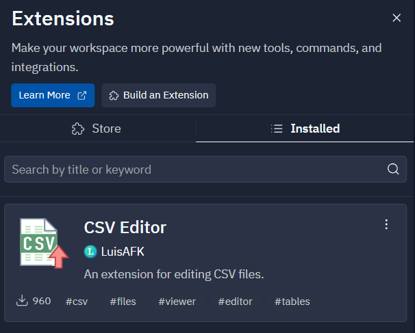

# Replit Tips

## Space Settings
Go to the `Settings` tab and change two things:  
**Indent type** = spaces  
**Indent size** = 4  
```{admonition} See Screenshot
:class: dropdown

```

These will make your code look easier to read and conform to all the template files provided to you.

## Viewing CSV Files
You'll want to install an Extension. Open the Extension manager in.
Search using they keyword "csv". Then, choose to install the CVS Editor.
Once installed, you'll see the following in the Installed tab.  
.   

To open a file using the editor, right-click on the CSV file and choose: `Open with CSV Editor`. 

## Restart Server
Sometimes the replit evironment may have the CPU or RAM pegged even though you're not doing anything.
To fix this, in the `shell` tab, run the command: `kill 1`


