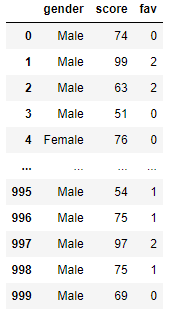
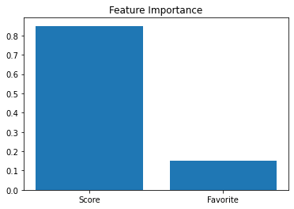

# Classification - Fully Random


In this example, we will attempt to predict ones gender from two other values. We will use a `DecisionTreeClassifier` to 
make the predictions. We will be a little tricky in that the label will be completely random! Read through each tab
to see the data, code, and what we learned.  

````{tab-set}
```{tab-item} Data
The gender is `Male` 92% of the time and has no relationship to the features.  
  
**Code used to generate the data**  
```python
# let 92% of the population be Male and the features be completely random
gender = [ 'Male' if random.random() < 0.92 else 'Female' for n in range(1000)]
f1 = np.random.randint(50, 101, size=1000)
f2 = [ random.randint(0, 2) for n in range(1000)]

df_gender = pd.DataFrame({'gender':gender, 'score':f1, 'fav':f2})
features = df_gender[['score', 'fav']]
labels = df_gender['gender']
```
```{tab-item} Model Accuracy
This code will build a model, split it up for training and testing, train it, and then
provide an accuracy score. Note that we present the accuracy score as a percentage out
to only 2 decimal places. The output is: `Accuracy: 89.67%`  
```python
# Create an untrained model
model_tree = DecisionTreeClassifier()

# Split the data into training and testing sets
train_f, test_f, train_l, test_l = train_test_split(features, labels, test_size=0.3)

# Fit the model to the training data
model_tree.fit(train_f, train_l)

# get the accuracy of our model
label_predictions = model_tree.predict(test_f)
print(f'Accuracy: {accuracy_score(test_l, label_predictions):.2%}')
```
```{tab-item} Feature Importance
Here, we ask the model for the `Feature Importance` which should tell us how much it relied on
all the features in the predictions. Surprisingly, it has some pretty high values! 
> **OUTPUT:**  
> Feature: score, Importance: 84.94%  
> Feature: fav, Importance: 15.06%

  

```python
# get importance
importance = model_tree.feature_importances_
# summarize feature importance
for index, feat_importance in enumerate(importance):
    print(f'Feature: {features.columns[index]}, Importance: {feat_importance:.2%}')
# plot feature importance
plt.bar(x=['Score', 'Favorite'], height=importance)
```
```{tab-item} Model Graphic
You'll see that the model is giant! We didn't constrain the model and it attempted to
memorize the data. 
  
**Code Used to Generate the Graphic**  
```python
plt.figure(figsize=(12, 6))
plot_tree(model_tree, filled=True, feature_names=features.columns, class_names=model_tree.classes_)
```
```{tab-item} Summary
The model and the output leads us to believe that:  
* predictions could be with ~90% accuracy  
* the feature `Score` had a significant Importance in the prediction  
* the data was not random  

The sad thing is, this model could have predicted with 92% accuracy by always predicting
`Male` regardless of the features. The data was, in reality, completely random and the
DecisionTreeClassifier was never the wiser (dare I say, DUMB!). 
```
````