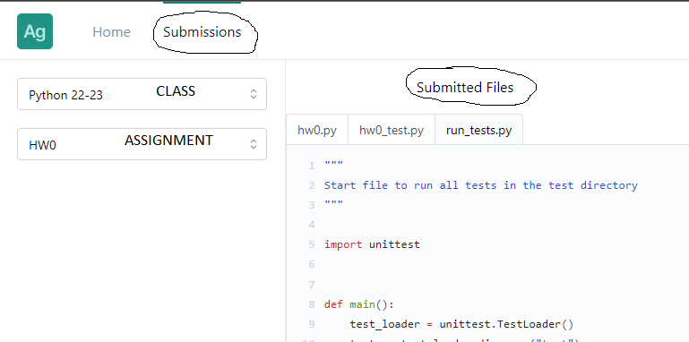
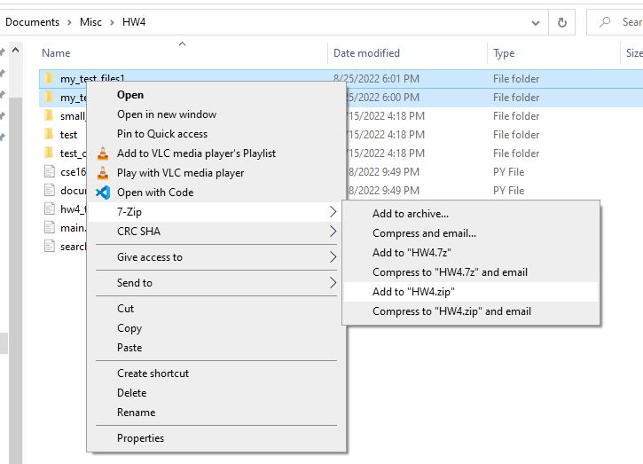
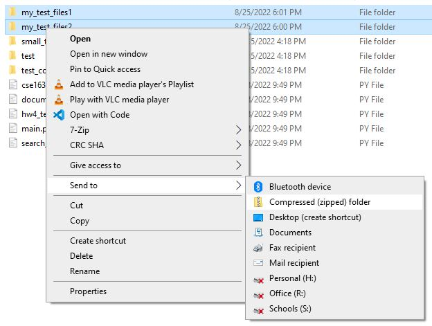

# Submitting

Students are to submit all **Checkpoints** into `Replit`. It's simple. Click the "Submit" button. Once you submit, the date-time is recorded. If you need to change your files, go ahead. But, your changes won't be seen by Mr. Stride until you hit the "Submit" button again, at which point, the date-time will change. If the new date-time is after the due date, some penalties _may_ apply.

Students are to submit the **Homework Assignments** to the <a href="https://autograder-nchs.vercel.app/login" target="_blank">Code Submission Site</a>.  This page explains why and how.  

## Why?
Often a student will develop their code in `Replit`, which is awesome for several reasons:  
1) There may be some Unit Tests available  
2) The work is hosted in the cloud which means the files are available on any computer with internet access  
3) There is no installation to worry about  

However, Mr. Stride uses a tool to help him more quickly grade the code. The tool does the following:  
1) Runs extra, student-unseen Unit Tests  
2) Follows a rubric that is defined for each assignment  
3) Quickly summarizes scores allowing Mr. Stride to more quickly enter the scores into the gradebook  
4) Emails students the rubric scores and comments  
5) Allows resubmissions at anytime; it helps highlight differences   
6) Supports easily & quickly reusing comments across students  

## Getting Access
To start using the <a href="https://autograder-nchs.vercel.app/login" target="_blank">Code Submission Site</a> you
need to **first** register your Google Authentication with this site. All you need to do is visit the site using
your Student Google Credentials. There is a bug with the site and you may get an error at first. Simply retry and
it should display the site. You won't see any classes or assignments at the get-go.  

**Second**, Mr. Stride needs to add you to a class. He cannot do this until you register with the site.  

## Submitting Files
Each assignment will have requirements about which files to submit. The list of files to submit should be
provided for you in the Homework Assignment. The experience you have can be best explained by describing
the submission rule categories:  
* **Restricted:** You may submit only the required files. You are **not** allowed to submit any other files.  
* **Open:** you may submit any file that hasn't been explicitly disallowed. This is necessary when students are allowed (perhaps required) to create test files. Or, it may be the assignment is open-ended and it is impossible to know the names of all the files.  

Some files will be explicitly disallowed, such as `tox.ini` or `cse163_utils.py`. These are files that should
remain unchanged. If you change these files in order to get your code to work, you're breaking the rules!!
And, as a consequence, you code may fail the Unit Tests on Mr. Stride's machine during grading.  

### Downloading from Replit
Most of the time, you'll be developing your code in `Replit`. To sumbit your files, you'll first need
to download the file from Replit to your local computer. Since there usually are not too many files
that you need to submit, you'll often want to download each file individually.  

In the list of files in Replit, hover over the file. You'll see some vertical dots (ellipses) pop up on 
the right-hand side. Click on the dots to reveal a menu of options. Choose, <i class="fas fa-download fa-fw"></i> `Download`.

```{admonition} file(1).py
:class: warning
Students often will download a file from Replit multiple times. In Windows, each time you download a file
it is put into the `downloads` folder. If the filename already exists in the downloads folder, Windows will
append a parenthetical version to the filename. For example: the first time you download `file.py`, it will
be named `file.py``. If you download it again without having deleted the first file, Windows will download
the file as `file(1).py`. It is important to recognize that this is a different name!! 

If the assignment requires `file.py`, you **cannot** expect `file(1).py` to work. Mr. Stride will not
rename the file for you. You must rename the file before submitting.
```

### Uploading to Site
On the <a href="https://autograder-nchs.vercel.app/login" target="_blank">Code SubStation</a>, you'll
select the class and assignment from the dropdowns on the left. This will open a pane on the right where you
can drag-and-drop your files, or browse to them. Once all the files are present, click the `Submit` button.
The expected successful submission should result in: the pane disappears, you get a verification pop-up, and the 
file contents will appear in the `Submissions` tab.  

> **NOTE:** It is valuable to verify your submission. Use the instructions below.  

### Verifying Submisson
After you upload **_all_** the required files, the `Status` column should read <span style="color: darkgreen; background-color: lightgreen">COMPLETE</span>. If you are missing some required files, it won't be complete.  

You can **double** verify that the upload was successful. On the top of the page, there are two "tabs" 
named, `Home` and `Sbumissions`. Click the **Submissions** tab. Then, select your class and assignment from the 
dropdowns. If your files were received, you'll see some more tabs appear on the right. Click on the filename
to see the contents. If the code can be seen, the submission was successful!  

If you don't see your code, then it's not there and Mr. Stride cannot see it either!  

  

### Submitting Subdirectories
Sometimes it is appropriate to create subfolders<a href="#footnotes"><sup>[1]</sup></a> with datafiles. Creating a folder structure is an excellent way
to add clarity. In order to communicate the directory structure of your files, we make use of `zip` files. This adds
some complication to the submission process. Most of the time, zipfiles are disallowed and unncessary.  

For some assignments, it will be required that submit test files created in subfolders. You'll 
create test files in subdirectories, zip the subdirectory, and submit the zipfile. 
This is extra work. Sorry! 

Zip your subdirectories, but ONLY your subdirectories. If you have more than one subdirectory, you can zip 
them all into the same zipfile if you want, or you may keep them
separate and submit two zipfiles. Do **NOT** zip up any other files. Zip up only the subdirectories you
want to submit.  

Here are some images to help you create a zipfile for this project (on Windows).  
  
You'll see that the two test directories are selected. Then, we `right-click` on the selection
and choose `7-Zip -> Add to "HW4.zip"`. Of course, not all computers are the same, so, here is
another option for you.  
  
Again, the two test directories are selected. Then, we `right-click` on the selection
and choose `Send to -> Compressed (zipped) folder"`.  


```{admonition} Limitations
:class: warning

Zipfiles cannot contain any file in the _working_ (or _root_) directory.  
Zipfiles cannot contain any of the required files (which are always in the _root_ directory).  
When you resubmit a Zipfile, it should contain all the files of the original zipfile.  
```
#### Footnotes
[1] `subdirectory` and `subfolder` are identical. There is no difference between these two terms. We will use them interchangably. 
