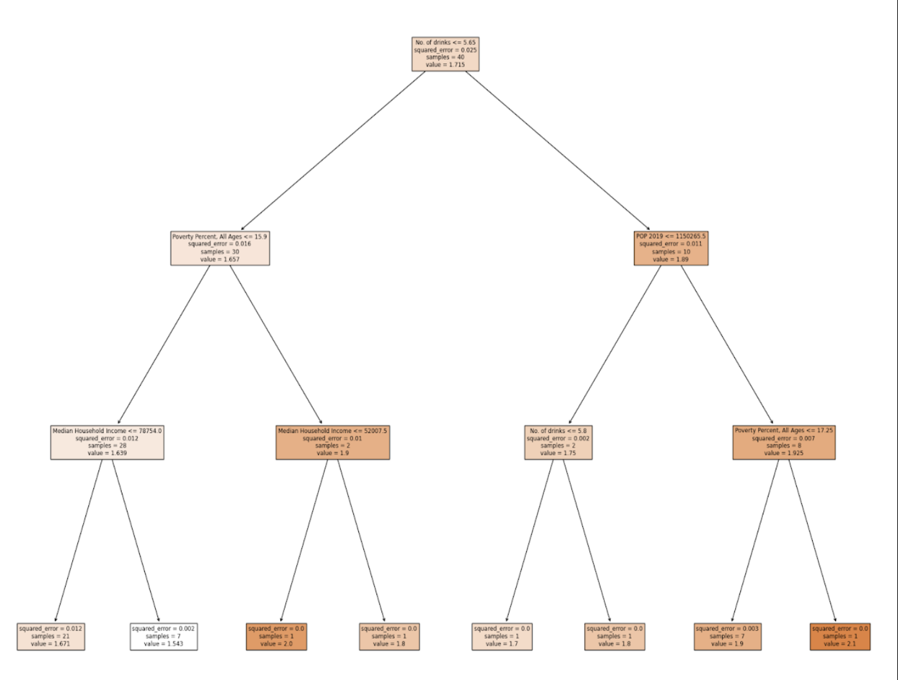
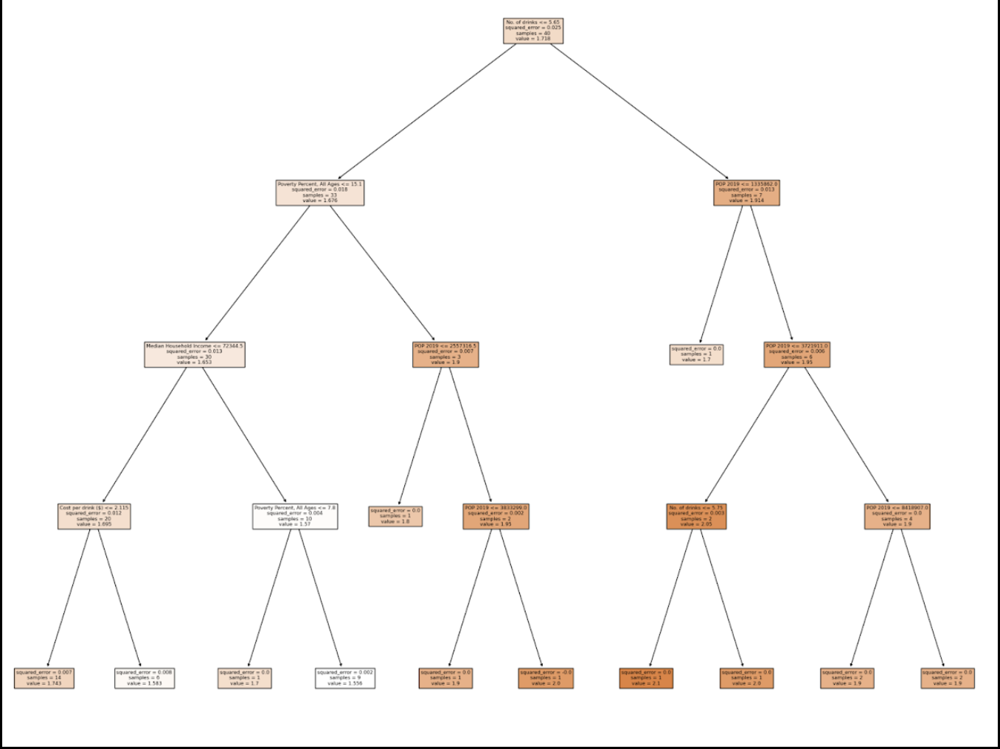

# <i class="fas fa-book fa-fw"></i> Leveraging ML 
As previously discussed, there are two principal categories of models: classification and regression. When conducting computations and analysis for your final project, it is important not to merely present numerical outputs. You need to ask yourself what the real-world significance is and draw practical implications. Use your correlations and models to identify patterns and trends, which, in turn, form the basis for making informed predictions.

There are a few approaches you can take to draw effective and insightful information from the performance of an ML model. For the problem provided as an example, four different approaches are taken. 

## Example Situation
The prevalence of alcohol abuse remains a significant public health concern in the United States. To address this pressing issue and gain insights into the factors influencing alcohol abuse rates, a  machine learning (ML) model has been developed. 

The following creates a regression model to predict the alcohol prevalence (label) in a state in the US given information that represents that state (features). **For the context of this problem, alcohol prevalence is defined as the median number of binge drinking occasions in a period of 30 days.**

````{tab-set}
```{tab-item} Features
Features: Median Household Income, Poverty Percent, Ages, Cost per Drink ($), Population Density, Graduation Rates
```
```{tab-item} Label
Label: Alcohol prevalence (Median No. of Binge Drinking Occasions)
```
```{tab-item} Dataset 

```
````
## Model Performance Evaluation
(1st Approach) Assessing the model's performance metrics, such as mean squared error, allows you to gauge the model's accuracy and generalization capabilities. This information is essential for understanding how well the model is likely to perform on new, unseen data.
````{tab-set}

```{tab-item} Mean Squared Error
Train Error: 0.0061

Test Error: 0.0250

> **NOTE**: You should not list out long, super precise values. If your Training Error is 0.006199999, just list it as 0.0061.
```
```{tab-item} Comments
The model was accurately able to predict the alcohol prevalence value as indicated by the small testing error. 
 
This is a good start, but stopping at this point is not sufficient for the final project. There are many unanswered questions. **What implications does this have? What predictions can be made? Which features are most important? If any?**
```
````

## Identifying Important Features
(2nd Approach) By analyzing the feature importances, you can determine which variables have the most significant impact on the predicted outcome. This information is crucial for understanding the driving factors influencing the label.

To better understand the factors and their influence in alcohol prevalence, a Feature Importance analysis can be performed. Using the API provided by the **DecisionTreeRegressor** class, you can determine which of your features are most influential in the model’s predictions. 
````{tab-set}
```{tab-item} Code
```python
# Split into training and testing data
train_f, test_f, train_l, test_l = train_test_split(features, labels, test_size=0.2)
model = DecisionTreeRegressor(max_depth = 4)

# Train it on our training data
model.fit(train_f, train_l)
importance = model.feature_importances_

# Determine feature importance
list1 = features.columns
for i,v in enumerate(importance):
print('Feature: %0s, Score: %.5f' % (list1[i],v))


plt.bar([x for x in range(len(importance))], importance)

plt.savefig("feature_importance")
```
```{tab-item} Output
Feature: Median Household Income, Score: 0.23044

Feature: No. of drinks, Score: 0.42769

Feature: Poverty Percent, All Ages, Score: 0.25019
Feature: Grad Rates: 2015-2019, Score: 0.03506
Feature: POP 2019, Score: 0.05662
Feature: Cost per drink ($), Score: 0.00000
```
```{tab-item} Comments 
Although the exact numbers varied each time, the general trend showed that among all six features, the most influential feature was: **the Median Number of Drinks on one Occasion**, and the second most influential feature was: **Median Household Income.** 

A higher score means that the specific feature will have a larger effect on the model that is being used to predict a certain variable. As you can see, the No. of Drinks had the highest score, and the Median Household Income had the secondest highest, showing that these are the two most influential features in the Machine Learning Model. 
```
````
## Decision Tree Analysis 
(3rd Approach) Another technique to better understand the significance of the results of your ML model is to analyze what decisions were being made by the model to make predictions. You can do this by printing out images of your decision tree using the API provided by **sklearn.**

Using the hyperparameter “max_depth”, you can restrict and change the length of the decision tree and observe how that affected the decisions being made at each node. In this case, the height was changed three times and an image of the Tree was generated each time.

````{tab-set}
```{tab-item} Code
```python
# Split into training and testing data
train_f, test_f, train_l, test_l = train_test_split(features, labels, test_size=0.2)
model = DecisionTreeRegressor(max_depth = 4)

# Plot decision tree using helper method
plot_tree(model, train_f, train_l)

def plot_tree(model, features, labels):
'''
This method plots the Decision Tree Regressor Model
It allows us to observe the decisions being made at each node
and which features were most used in the decisions
'''
fig = plt.figure(figsize=(25,20))
_ = tree.plot_tree(model,
feature_names=features.columns,
class_names=labels.columns,
filled=True)
fig.savefig("decision_tree.png")
```
```{tab-item} Output
Max Depth: 2


Max Depth: 3



Max Depth: 4




```

```{tab-item} Comments 
After analyzing the tree, we determined that for each version of the tree, the very first decision was made based on the feature: No. of drinks. This supports the results given by the feature importance, where it represented No. of drinks with the highest score. 

Following the first decision, the second level of decisions across all trees mainly involved the poverty percent and 2019 population. This was surprising since the calculated feature importances for these two features did not show them to be as relevant to the model. 

During the third set of decisions, and following that, median household income was used once or twice, and poverty percent, the number of drinks, and population were frequently repeated in the decisions. This allowed us to see that poverty percent, population, and number of drinks were the most influential features in the decision making the tree made. 

It is important to note that cost per drink was only utilized by the Decision Tree with a max depth of 4, and it was only used for one of the minor decisions. The college graduation rates feature was not used in any decision across all of the Decision Trees. 

Through this, we can successfully conclude that our most influential feature was the number of drinks, and the relevance of poverty percent, population, and median household income was about the same. In the end, we decided to use a max depth of 4 in our code to make sure that we did not have a high bias while still making sure that we weren’t overfitting. 
```
````

## Prediction and Forecasting
(4th Approach) Regression models are commonly used for predicting and forecasting numerical values based on historical data. The model's predictions can provide valuable insights into future trends, patterns, or behaviors, aiding in decision-making and planning.

In the context of Alcohol Prevalence for a given state, the following decisions can be made in order to better the lives of individuals living in these areas: 

1. **Public Health Policy:** The predictions from the model can offer insights into the alcohol consumption patterns of a specific state's population. Policymakers and public health officials can utilize this information to develop targeted interventions and awareness campaigns aimed at addressing potential alcohol-related issues or promoting responsible drinking habits.

2. **Alcohol Addiction and Treatment:** Understanding the predicted alcohol consumption rates can help identify areas with higher alcohol usage, indicating potential hotspots for alcohol addiction problems. This knowledge can aid in directing resources and treatment programs to regions where they are most needed.

3. **Socioeconomic Patterns:** The predictions of the model may indicate relationships between alcohol consumption rates and socioeconomic elements like income, education, or employment rates. Such information can be used to examine the connection between alcohol use and social determinants of health.

4. **Alcohol-Related Accidents and Crimes:** Higher alcohol consumption rates may be associated with an increased risk of alcohol-related accidents and crimes. Policymakers and law enforcement agencies can use the model's predictions to target areas with higher predicted consumption rates for enforcement and prevention measures.
