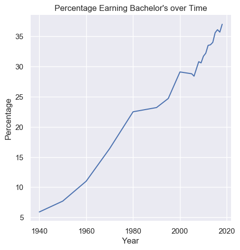
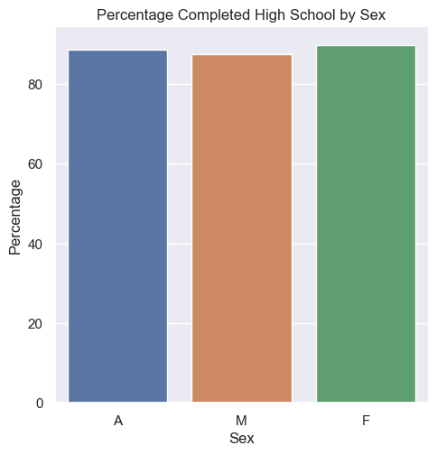

# <i class="fas fa-laptop fa-fw"></i> HW4 - Education

## Overview
**Learning objective:** Apply Pandas, Seaborn, and Scikit-learn to process, visualize, and predict outcomes about data.  

## Files and Tests
````{tab-set}
```{tab-item} Provided Files
* `nces-ed-attainment.csv` is a CSV file that contains the education dataset for this assessment.  
* `hw4.py` is the file for your implementations. The Run button executes this program.    
* `hw4-writeup.md` is the file for your writeup. Instead of testing, this assessment emphasizes reflection on our data analysis.  
* `cse163_imgd_NCHS.py` is a helper file that checks your plot outputs against expected output, and creates an image showing any pixel differences. See the **Image Comparison Tool** tab for more information.   
* `main.py` is present simply to allow Replit Unit Tests to run.  
* `tox.ini` configures the rules enforced by `flake8`. We will eliminate some rules to hopefully make development a bit easier. Do **NOT** submit this file because your submission will be ignored during grading. Do **NOT** modify this file if you want `flake8` to pass during grading.  
* `expected` is a folder containing the expected output for `line_plot_bachelors` and `bar_chart_high_school`. Don’t modify the contents of this folder.   
```
```{tab-item} Files to Submit
You must submit your work to the <a href="https://autograder-nchs.vercel.app/login" target="_blank">Code Submission Site</a>.  

You are to submit the following two files ONLY:  
* `hw4.py`  
* `hw4-writeup.md`  

Do NOT submit anything else.
```
```{tab-item} Replit Tests
These tests are to help you gain some confidence that your code is ready for grading. But, there are some issues
with image comparison tests. Furthermore, there are a gazillion ways to make plots and each one can have minor,
sometimes major, differences. It is best if you pass all these tests, but don't stress too much if you don't
pass the image comparison tests: use the image comparison tool to help you verify.   
Tests:  
* **hispanic_plot** - Tests that the plot_hispanic_min_degree.png is similar enough to the expected image.  
* **bar_chart_high_school** - Tests that the bar_chart_high_school.png is similar enough to the expected image.  
* **line_plot_bachelors** - Tests that the line_plot_bachelors.png is similar enough to the expected image.  
* **top_2000s** - Tests that the method top_2_2000s has good return values.  
* **fit_and_predict** - Tests that `fit_and_predict_degrees` returns an acceptable error value.   
* **bachelors_1980** - Tests that `compare_bachelors_1980` returns acceptable DataFrame.  
```
```{tab-item} Image Comparison Tool
Included with the Replit startup code is a file `cse163_imgd_NCHS.py` which will compare the student's
image with the expected image (provided in the _expected_ subfolder), and generate a _diff image_ that
is saved in the _compare_ subfolder. Differences between the two images will be highlighted in hot pink.   

To run the tool, you will need to modify `.replit` to run `cse163_imgd_NCHS.py`. Or, if you want, you can
temporarily call the comparison using the following code:
```python
# This is in hw4.py
from cse163_imgd_NCHS import compare_hw4_images

def main():
    # All your code goes here
    # then, temporarily call the comparison method
    # Comment out this line before submitting
    compare_hw4_images()
```
````
## Context
The National Center for Education Statistics is a U.S. federal government agency for collecting and analyzing data related to education. We have downloaded and cleaned one of their datasets: Percentage of persons 25 to 29 years old with selected levels of educational attainment, by race/ethnicity and sex: Selected years, 1920 through 2018. The nces-ed-attainment.csv file has columns for Year, Sex, Min degree, and race/ethnicity categories.   
> Note the missing data: not all columns have data starting from 1920! And, Our `main` method provides a line of code to read `nces-ed-attainment.csv` and replaces all occurrences of the `---` with pandas `NaN` to help with later data processing steps.  

|Year|Sex|Min degree|Total|White|Black|Hispanic|Asian|Pacific Islander|American Indian/Alaska Native|Two or more races|  
|----|---|----------|-----|-----|-----|--------|-----|----------------|-----------------------------|-----------------|
|1920|A|high school|---|22.0|6.3|---|---|---|---|---|
|1940|A|high school|38.1|41.2|12.3|---|---|---|---|---|
|⋮|⋮|⋮|⋮|⋮|⋮|⋮|⋮|⋮|⋮|⋮|
|2018|F|master's|10.7|12.6|6.2|3.8|29.9|---|---|---|


* `Year` is the year for the row. There may be more than one row for the same year to show the breakdowns by sex.  
* `Sex` is the sex of the people for the row: `F` for female, `M` for male, or `A` for all students.  
* `Min degree` is the degree of educational attainment for the row: `high school`, `associate's`, `bachelor's`, or `master's`.  
* `Total` is the overall percentage of people of the `Sex` in the `Year` with at least the `Min degree` of educational attainment.  
* `White`, `Black`, `Hispanic`, `Asian`, `Pacific Islander`, `American Indian/Alaska Native`, `Two or more races` is the percentage of students of the specified race (and of the `Sex` in the `Year`) with at least the `Min degree` of educational attainment.  
  

```{admonition} Warning
:class: warning
Do not use any loops, list comprehensions, or dictionary comprehensions. The goal of this assessment is to apply data science libraries to answer questions.  

Be sure to call all of the functions you write inside your `main` method!
```

## main

<i class="fas fa-pen-square fa-fw"></i> **Write** a `main` method in `hw4.py` that loads in the dataset provided and calls all of the functions you wrote. For all of the method calls, you should rely on any default parameters we specified.  

## Pandas Methods
Implement two methods `compare_bachelors_1980` and `top_2_2000s`. 
````{tab-set}
```{tab-item} Method 1
Answer the question: **What were the percentages for women vs. men having earned a Bachelor’s Degree in 1980?**  

<i class="fas fa-pen-square fa-fw"></i> **Write** a function `compare_bachelors_1980` that takes one argument, `data`, and _finds_ the percentages of men and women who achieved a minimum degree of a Bachelor’s degree in 1980. The result should be a 2-by-2 `DataFrame` with rows corresponding to men and women and columns corresponding to `Sex` and `Total`. The order of the rows doesn’t matter. For example, your result should look something like this:

|Sex|Total|
|---|-----|
|M|...|
|F|...|

```{admonition} Requirement
:class: note
Your code should ONLY assume the structure of the data. Your code should **not** make any assumptions about the number
of rows or where values exist. Your code should work on a different data set with different index values.
```
```{tab-item} Method 2
Answer the question: **What were the 2 most commonly-awarded levels of educational attainment awarded between 2000–2010 (inclusive) for a given sex?**   

<i class="fas fa-pen-square fa-fw"></i> **Write** a function `top_2_2000s(data, sex)` that takes two arguments, the `data` and a `sex` parameter, and computes the two most commonly earned degrees for that given sex between the years 2000 and 2010 (inclusive). The function should return a 2-element `Series`. Compare educational attainment levels by using the `mean`. The index of the returned `Series` should be the `Min degree` and the values should be its `mean`. The `sex` parameter should default to `'A'` if no `sex` parameter/value is provided by the caller.

> Hint: `Series.nlargest` works like `DataFrame.nlargest`. The Series method takes only a single integer argument and returns a Series, while the DataFrame method requires an additional column parameter and returns a DataFrame.  

Here is an example: `top_2_2000s(data, 'A')` will return the `Series` shown below with index on the left and value on the right. Your values don’t have to exactly match so long as they’re within a 0.001 tolerance due to <a href="https://docs.python.org/3/tutorial/floatingpoint.html" target="_blank">how Python represents float numbers</a>. Because `sex` is set to default to `'A'`, this means a call to `top_2_2000s(data)` should also return the same `Series`.

```html
high school 87.557143  
associate's 38.757143
```
````

## Plotting Methods
You will **NOT** use `Seaborn` to create your plots. You will use matplotlib.pyplot only when you implement the following three methods: `line_plot_bachelors`, `bar_chart_high_school`, `plot_hispanic_min_degree`.

```{admonition} NO Seaborn
:class: warning
For all three plots (`line_plot_bachelors`, `bar_chart_high_school`, `plot_hispanic_min_degree`) there is NO `seaborn` allowed.  
Use the following API:  
* `df.plot()`  
* `series.plot()`  
* `plt.grid()`  
* `plt.legend(...)`  
* `plt.legend().set_visible(...)`  
* `plt.xticks(ticks=...)`  
Do **NOT** use other methods of plotting.  

This is to assure that the image comparison tests can work.  
```
```{admonition} ChatGPT Usage Allowed
In this Homework, I'm asking you to build some specific plots. This can be difficult to do without some help with the API. Go ahead and use the internet to help out. Figure it out with AI.   
  
**IMPORTANT**: Understand the code. You will be expected to replicate this kind of code on the Exam.   
  
**IMPORTANT**: Do not copy from a friend. This is an exercise in looking things up and getting help from the internet. This is NOT an exercise in how to plagiarize off of a fellow student!  
```
````{tab-set}
```{tab-item} Plot 1
<i class="fas fa-pen-square fa-fw"></i> **Write** a function `line_plot_bachelors` that takes the `data` and plots a line chart of the total percentages of all people (`Sex` == `'A'`) and whose `Min degree` is `bachelor's`, graphed over time. Label the x-axis **Year**, the y-axis **Percentage**, and title the plot **Percentage Earning Bachelor's over Time**.  

Your plot should look like this:  


Use the following line of code to save the plot:
```python
plt.savefig('line_plot_bachelors.png', bbox_inches='tight')
```
```{tab-item} Plot 2
<i class="fas fa-pen-square fa-fw"></i> **Write** a function `bar_chart_high_school` that takes the `data` and plots a bar chart comparing the total percentages of `Sex` `F`, `M`, and `A` with `high school` `Min degree` in the `Year` `2009`. Label the x-axis **Sex**, the y-axis **Percentage**, and title the plot **Percentage Completed High School by Sex**.  

> Hint: When you plot using `df.plot()`, use the named argment `color`. Set the colors using the string contants, `'blue', 'red', 'green'`.  

Your plot should look like this:  


> Ask yourself: Is this visualization a fair and effective plot? You will need to answer this in the `hw4-writeup.md`.  

Use the following line of code to save the plot:
```python
plt.savefig('bar_chart_high_school.png', bbox_inches='tight')
```
```{tab-item} Plot 3
<i class="fas fa-pen-square fa-fw"></i> **Write** a function `plot_hispanic_min_degree` that takes the `data` and plots how the percentage of `Hispanic` people with degrees have changed between 1990–2010 (inclusive) for `high school` and `bachelor's` `Min degree`. Create a plot that matches the plot shown below.   

  
Use the following line of code to save the plot:
```python
plt.savefig('plot_hispanic_min_degree.png', bbox_inches='tight')
```
````

## Scikit-learn Requirement
<i class="fas fa-pen-square fa-fw"></i> **Train** a `DecisionTreeRegressor` to predict the percentage of degrees attained for a given `Sex`, `Min degree`, and `Year`. Write a function `fit_and_predict_degrees` that takes the `data` and returns the **test mean squared error** as a `float`. Follow these specific data preprocessing and model training steps.

**Preprocessing**: Filter the `DataFrame` to only include the columns for `Year`, `Min degree`, `Sex`, and `Total`. Drop rows that have missing data in these columns—**do not drop any additional rows**. One-hot encode `str` values. Split the columns as needed into input features and labels.

**Model training**: Once the data has been preprocessed, randomly split the remaining `data` into 80% training and 20% testing. Fit the model to the training set. Finally, calculate the mean squared error of the model’s test set predictions.

The automated tests only check that the function runs without causing an error. Try comparing the ground truth values and the model’s predictions manually to check for similarity. (It would be bad if the ground truth values were `[2, 755, ...]` but the predicted values were `[1022, 5, ...]`.) Also, try calculating the mean squared error on the training dataset as well as the testing dataset—the error should be lower on the training dataset than on the testing dataset.

```{admonition} Info
:class: note
This education dataset is a time series. When working with time series, it is common to use the last rows as the test set rather than random sampling since the goal is to design a model that predicts the future. But by randomly sampling to generate the test set, we are assessing the model on its ability to predict the past! Even though random sampling is not necessarily appropriate here, we ask you to do it anyways because it’s the most common sampling method.
```

## Markdown Writeup
You are required to answer a few questions in the file `hw4-writeup.md` file. Furthermore, you are **required** to use some markdown that structures your answers nicely.  

Markdown (which uses the file extension, `md`) is a relatively simple text formatting language used in many places (Wikis, Replit Instructions, Jupyter Notebooks). Markdown offers a natural-looking way to define headings, lists, and links using special characters like #.  

For full points in your write-up, you **MUST** format with Markdown. Here is a [Markdown reference](https://www.markdownguide.org/basic-syntax/).  Be sure to included multiple forms of formatting such as: `_italics_, **bold**, > block quotes, * bullets`.  

## Code Quality
Assessment submissions should pass these checks: `flake8`, and <a href="https://courses.cs.washington.edu/courses/cse163/22sp/resources/code_quality/" target="_blank">code quality guidelines</a>. The code quality guidelines are very thorough. 

```{admonition} Reminder
:class: important
Make sure to provide a descriptive comments in doc-string format.
```  
## Rubric
Rubric information can be found in the instructions in the Replit project.   

## Challenge Question

**OPTIONAL**: This challenge question is not graded and is here for those students who already know Python and want to flex some of their intellectual muscle.  
**NOTE**: If you implement this challenge question, you'll need to document all methods fully with doc-strings so that all the grading scripts pass. You don't want to have your grade drop!  Be sure to test it, too!  
* * * 
<i class="fas fa-pen-square fa-fw"></i> **Create** a figure with two bar charts that looks like the following.  
   
The first bar chart will illustrate by `Sex` the percentage who have earned a High School degree. A few things to note:  
* The labels for each bar are customized to 'Combined', 'Male' and 'Female'.  
* There is no 'Sex' label on the x-axis.  
* The bottom of the chart starts at 86.5%.  
* The y-label is 'Percentage'.  
* Each bar is annotated with the value of the bar.  

There is a second bar chart plot in the same figure. Once again, there are some important features to recognize and replicate:  
* The x-axis labels are the races.  
* There are two side-by-side bars for Male and Female as shown in the legend.  
* The legend is not on top of the figure, but off to the right side and aligned with the top of the plot.  
* The bar labels are slanted and the end of the text aligns perfectly centered with the bars.  
* The bars start at 60%.  

```{admonition} Reflect
:class: note
What does this figure tell you? How can you explain it? Expand the 'conclusions' below to see Mr. Stride's conclusions.  
```

```{admonition} Conclusions
:class: error dropdown
Females get more degrees on average, yet when we look at this graph we can see that for many of the races, males do just as well, if not better, than females. In fact, for some of the most populous races (White), females have a lower percentage of high school degrees. This should lead one to think more deeply about how females have a higher average.  

One can consider `Simpson's Paradox`. The does **NOT** really apply because males do not do better in each individual category. However, it is possible that the ratio of races is different for males than it is for females.   

Likely, there are a significant number of Hispanic women in the data which elevates the overall average to be 'significantly' larger than the Male average despite many of the races being higher for Males.  

Overall, this data should beg the question: **What is the ratio of races for each gender?**  and **Why are some races doing significantly different depending on the gender?**  

We could do a plot over time to see if 2009 is an outlier. We'd want to see when females start to do better than males, and if that correlates to any specific race.   
```

Annotate each bar with the value.
The second bar chart will be a stacked bar chart by race for male and female, and each stacked bar will be annotated. 
The final figure will look like the one below.  
