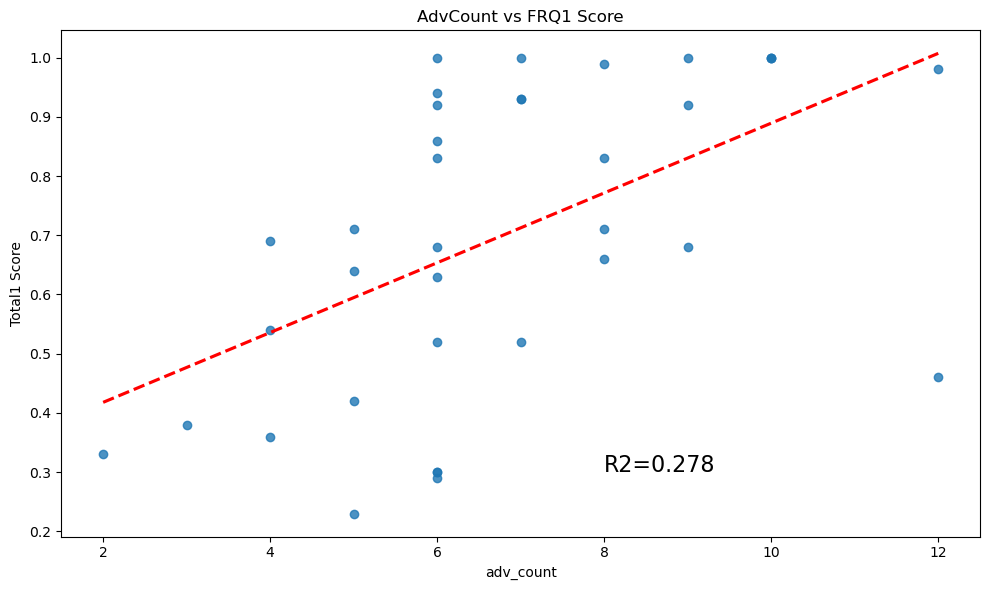

# Predicting Success

In the Fall of 2025, I took only 14 questions that could be seen as predicting success. I had the students answer the questions in the first week of class--before they had done any homework or spent time in class. To account for the fact that they could not answer how difficult CSS 143 was, or how much they enjoyed the homework given in 143, I had to I altered a few question. Effectively, I used they experience with 142 as a proxy.  

## First Exam Results
The plots below show the results quite well. With fewer data points, I decided to use 6 as my point of division to create the two sub-groups. The disadvantaged group would have fewer than 6, and the advantaged group would have more than 6. I did not include those who had exactly 6. 

Out of the 45 students originally enrolled, 3 students did not take the survey and 6 students dropped the course before taking the first exam. This left only 36 students to analyze. 

Nine students were in the disadvantaged group. Sixteen were in the advantaged group. These numbers are admittedly small.

### Free Response
The performance on the Free Response portion of the exam showed a greater divide. 
  
  

### Total Exam 
When we include the Multiplce Choice portion of the exam, the significance is diminished. 
  
  

## 14 Questions
1. What is your race/ethnicity?	  
2. Are you a first-generation college student? (Your parents did not go to college)	 
3. How fluent are you in English?	
4. Have you ever coded a project that was not required by school, club or CTSO?	 
5. Complete this sentence in the way that is most like you: "When I get stuck..."	
6. How much fun do you have while coding homework assignments?	 
7. How many friends do you have that are currently in, or have previously taken CSS 143?	
8. When you see a typical professional programmer, how much do you identify with the person?	
9. How many hours per week do you work a job?	
10. What was your final grade in CSS 142?	
11. How many total programming courses have already taken prior to CSS 143? (Include courses at all other schools. Count each course only once, even if you repeated it.)	
12. What is your current overall college GPA? (Estimate is fine)	
13. How easy or hard did you find CSS 142?	 
14. How often do you attend, or plan to attend, class for CSS 143?  