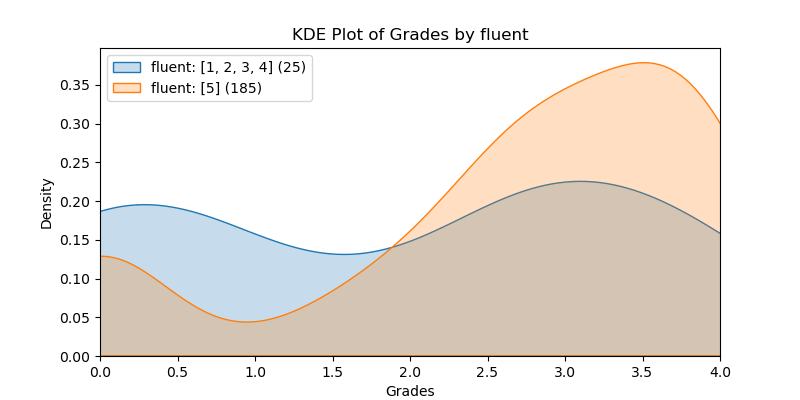
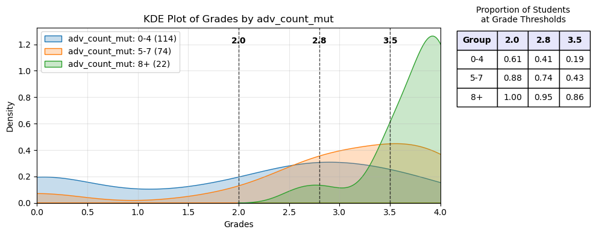

# Correlations to Success (draft)

## **Abstract**
Students *(n=210)* in the Computer Science pre-major course at UW Bothell, *Introduction to Programming II (CSS 143)*, responded to a multiple-choice survey four weeks into a ten week quarter. Fewer than 5 students did not respond the survey. The resulting data were analyzed by examining each question for correlations with a higher grade in the class. Two populations--*left* and *right*--were created by comparing opposite ends of participant answers and conducting a Student-t tests to determine whether there were significantly different mean grade values. Fourteen questions produced responses that formed populations with differing performance levels. Those that performed better are considered to be in the **right group** and to possess an "Advantaged Feature". Students with a higher count of advantaged features (nine or more out of fourteen) showed a strong correlation with academic success. This report explores the data and explains the processes used, but it does not attempt to explain the underlying reasons or suggest actions. 

## **Introduction**  
This study sought to identify correlations to success in University of Washington Bothell's *Introduction to Computer Programming II (CSS 143)* by examining student grades to demographics and answers to survey questions. A survey was administered in week 4 of a 10-week quarter for five different sections during the 2024-25 school year. All the sections were taught by the same instructor, Mr. Stride. There were 210 total respondants with fewer than 5 students not responding. Each participant's grade in 143 was recorded.  

All questions were multiple choice. There were several types of questions: Yes/No, Radio Options (4 or 5), Range of 1-5, Checkboxes (check all that apply). Many of the columns were mapped to values 1-5, and others were 1-hot encoded so that the most answers could be numerical. Specifics are explained in the *Data Description* section below. The data were explored by dividing the answers into two groups, a left and right group. For example, for a Yes/No question (mapped to 1/0), we examined to see if the grades of the students who answered `Yes` vary significantly from those who answered `No`. When the values had a range, the grouping depended on the quantity of the selections and where differences were revealed. For example, `grit1` split the answers so that the left side comprised `[1, 3]` and the right side was `[5]`.  The specifics on how each grouping was done is provided below.  

The data were inspected for correlations primarly by: Cohen's d value, Pearson's Coefficient, and Student-t p-value. Here is a brief explanation of Table #1.  

* Descriptions for what each `Feature` means are <a href="#top14">provided below.</a>  
* The table is ordered with the strongest correlations at the top. The strength of the correlations are determined by `Cohen's d` and `Student-t p-value`, both shown in the table below.  
* The `p-value` shown comes from the `Student-t` test and it is the probability of observing data as extreme as (or more extreme than) what was actually observed, assuming the null hypothesis is true (i.e., assuming the **left** and **right** populations ARE identical).  
* Results with `p-values` below *α = 0.02* are considered statistically significant.  
* `r` represents the `Pearson Correlation`.   
* The change in mean, represented with  $\bar{x}_1 - \bar{x}_2$ is the difference in the mean between the left and right groups.  
* The `+/-` column describes the 95% confidence interval.    

| Feature | cohen_d | p_value | `r` | $\bar{x}_1 - \bar{x}_2$ | +/- | left | right |
| --- | --- | --- | --- | --- | --- | --- | --- |
| 142grade | 1.076 | 5.740e-10 | 0.434 | 1.340 | 0.399 | [1, 2, 3] | [5] |
| difficulty | 1.059 | 2.651e-07 | -0.357 | 1.338 | 0.485 | [5] | [1, 2, 3] |
| fun | 0.951 | 1.310e-04 | 0.340 | 1.244 | 0.625 | [1, 2, 3] | [5] |
| race | 0.719 | 0.010 | 0.177 | 0.956 | 0.725 | Black | Other|
| friends | 0.695 | 0.003 | 0.201 | 0.839 | 0.543 | [0] | [3] |
| attend | 0.689 | 0.005 | 0.371 | 0.943 | 0.648 | [1, 2, 3, 4] | [5] |
| gpa | 0.641 | 1.052e-05 | 0.251 | 0.828 | 0.361 | <= 3.6 | >= 3.7 |
| priorcourses | 0.621 | 0.004 | 0.177 | 0.831 | 0.561 | [1, 2] | [4] |
| grit1 | 0.595 | 0.003 | 0.216 | 0.786 | 0.517 | [1, 3] | [5] |
| fluent | 0.556 | 0.010 | 0.183 | 0.740 | 0.559 | [1, 2, 3, 4] | [5] |
| identify | 0.486 | 0.016 | 0.225 | 0.650 | 0.528 | [1, 2] | [4, 5] |
| 1stgen | 0.453 | 0.004 | -0.201 | 0.600 | 0.401 | [1] | [0] |
| jobhours | 0.448 | 0.018 | 0.159 | 0.589 | 0.488 | [1, 2] | [5] |
| project | 0.427 | 0.003 | 0.201 | 0.566 | 0.377 | [0] | [1] |
**Table #1**  

Let's briefly examine the top feature, `142grade`, to illustrate what the table's values mean. We can see that those in the "*right*" group (students with a higher `142grade`) had an average grade increase in the CSS143 course of 1.34 &plusmn; 0.399 (95% confidence) over those in the "*left*". The Null Hypothesis that the *left* and *right* groups have the same mean value is strongly rejected because the p-value = 5.740e-10. 

**Areas of Interest**  
We will explore some areas of interest:  
1. `CodeTime`: For those students who ranked themselves in the middle of `difficulty` and `grit1`, there was a correlation to time spent coding each week. There was no correlation for those on either end.  
2. `Gender` : Males & females performed virtually identically.  
3. `selfeval_` : Students who performed well ( >= 3.6) credited their prior course work and the instructor for their performance more than the poor performing students (<= 2.0).  Regarding the remaining *performance explaination options*, poor-performing vs well-performing students did not explain their performance significantly differently.  
4. `adv_count` : The count of Advantaged Features correlates strongly to how well a student does in the course. Once a student gets to 9 (of 14) advantages, there is a very strong chance the student will perform well.  
5. `race` : Black students performed worse than other races. Black students had very few Advantage Features.   
6. `1stgen` : A first generation student was more likely to have fewer advantages and to perform poorly. A first generation student at a specific Advantage Feature count was likely to perform as good as other students at the same advantage count.   
7. `142x` : The number of times a student took CSS 142 does **not** correlate to performance in CSS 143.  
8. `143x` : The number of times a student previously took CSS 143 does **not** correlate to better performance, and those students tended toward a negative correlation (although not significant enough; p-value = 0.076). A student who took the course before is **not** more likely to perform better.  
    
**Advantage Feature Count**  
If a student falls in the "*right*" data set, we consider this to be an advantage. In an effort to identify a 3rd Cause for `1stgen` and `race`, we will at times excluded these two immutable features and call the remaining 12 "Advantaged Features Mutable." We counted how many advantages each student had and named this `adv_count` and `adv_count_mut`. Similar to the features themselves, we bisected the students into two groups: *left* = those who had 4/3 or fewer; *right* = those with 8/7 or more. These two groups had the following statistical values:

|col|cohen_d	| p_value | `r` | $\bar{x}_1 - \bar{x}_2$| +/-    |left|right|
|---|-----------|---------|-------------|------------|--------|----|-----|  
| adv_count | 1.526| 2.367e-12 | 0.493 | 1.747 | 0.437 | <= 4 | >= 8 |
| adv_count_mut | 1.638 | 7.374e-13 | 0.472 | 1.836 | 0.447 | <= 3 | >= 7 |

  
Here we see how the 36 students with a high advantage count performed significantly better than the other students. The curve shows the probability distribution while the table uses actual percentages from the data. Only 14% of students with 5 or fewer advantages achieved a 3.5 or better in the course, while 86% of students with 9 did.
   


## **Data Description**  
Data from 5 sections over 3 quarters in 143 class taught by Mr. Stride.  Data was collected in the 4th week of the course and so some students may have already withdrawn from the course. All data is self-reported except for the grade in 143. This is important because some answers may be accidentally wrong (e.g. overall gpa), and other answers will reflect intentions and not necessarily reality (e.g. grit, attendance). Two questions were give to only 2 sections (Attendance, Recency of 142). Show the questions, how they are mapped to shortened column names.  

The data went through several stages:  
1) Partial Raw Data: Three different files representing the students' answers. This data is not anonymized.
2) Full Raw Data: The three different quarters were concatenated together. Any corrected typos and added questions were manually corrected  
3) Grade &amp; Anonymous Data: The students' grades were joined with student names, and then the names and section information were removed.
4) Final Data: Answers were mapped to values. Multi-checkbox answers were broken out into a 1-Hot encoding. Each student Advantage Count was calculated and added.  

All in all, there were 55 Features extracted from the survey questions, and then two were derived from the top 14 (`adv_count`, `adv_count_mut`).  

<a id="top14"></a>
### Top 14 Feature Descriptions
Recall that the student, on week 4 of the 10 week course, self-reported all data except for their 143 grade. Except where noted, a value of 5 indicates the better score. 

|Feature|Mapped<br>Values|Description|
|-------|-------|-----------|
| 142grade | 1-5 | The student's grade in CSS 142. 5=Grade of 4.0. |
| difficulty | 1-5 | How difficult a student found the course. 1=Easy. 5=Hard.|
| fun | 1-5 | The amount of fun a student has while coding an assignment. |
| race | Categorical | The race of the student. |
| friends | 0-3 | The number of friends currently in or who have previously taken CSS 143.<br>0 &rarr; 0 Friends<br>1 &rarr; 1-2 Friends <br>2 &rarr; 3-4 Friends<br> 3 &rarr; 5+ Friends |
| attend | 1-5| How often a student intends to attend class. 5=Every day.|
| gpa | 2.0 - 4.0| Approximate overall college GPA (not continuous).<br>`{'4.0':4, '3.60 - 3.99':3.8, '3.10 - 3.59':3.35, '2.60 - 3.09':2.85, '2.10 - 2.59':2.35, 'Less than 2.10':2 }`|
| priorcourses | 1-4 | The total number of programming courses previously taken (not repeated). |
| grit1 | `[1,3,4,5]` | How a student deals with getting stuck; indicates `grit`.|
| fluent | 1-5 | How fluent a student is in English. 5=Fluent. |
| identify | 1-5 | How much a student identifies with typical professional programmer.<br>5=*It's like looking in the mirror*|
| 1stgen | 0/1| 1=Indicates the student's parents did **not** go to college.|
| jobhours | 1-5 | The number hours per week a student works.<br>1=30+ hours<br>2=17-30 hours<br>3=9-16 hours<br>4=1-8 hours<br>5=Zero hours|
| project | 0/1 |1=Indicates that the student has coded a project not required by school, club, or CTSO.| 

### Remaining Features
Below are specific descriptions of how the answers were mapped to the values used in this study (`data.csv`). The student survey questions can be seen in the file `Survey Questions - S2025.pdf`. 

Here is a table that shows how each Feature's value was generated from the student answer. Many of the mappings are expressed as a *Python dictionary* where the `key` is the student answer and the `value` is the resulting value used in the data.  

|Feature|Mapped<br>Values|Description|
|-------|-------|-----------|
| age |`[20, 22, 24, 27]`|The approximate age of the student.<br>`{'20 and younger':20, '21-22': 22, '23-25': 24, '26+': 27}`|
|profcomfort|1-5|How much comfort the student has getting help from the professor.<br>5=*"I rather like it"* |
|major|Categorical|The major the student is likely to pursue.<br>`[ Computer Science, STEM, non-STEM]` |
| 142x| 1-5| The number of times the student took CSS 142<br>`{1:1, 2:2, 3:3, 4:4, '5+': 5}`|
| 143x| 0-4 | The previous number of times the student has already taken CSS 143.<br> `{ 0:0, 1:1, 2:2, 3:3, '4+': 4 }`|
|hobby|0/1|1=The student considers programming to be a hobby.|
| codetime| `[1,3,5]`|The amount of time the student spends coding each week.<br>`{ '1-2 hours': 1, '3-6 hours': 3, '7+ hours': 5 }`|
|  family|0/1|1=Indicates the student has an immediate family member in the technology industry.|
|recent|1-5|How recently did the student take CSS 142.<br>`{'8+ quarters':1, '5-7 quarters':2, '3-4 quarters':3, '2 quarters':4,'last':5}` |
|grit2|`[0,1,2,4]`|How a student deals with getting stuck; indicates `grit`. |
|gender|Categorical| `[Male, Female, X, Prefer not to say ]`|
|oncampus|0/1 |1=Indicates the student lives on campus.|
|yearsus|1-4|How much education was done in the US.<br>`{'1-2 Years':1, '3-7 Years':2, '8-12 Years':3, 'Every year':4}`|

There were 5 questions that asked student to check multiple checkboxes. Each of these questions was 1-hot encoded with values `[0, 1]` indicating whether the box was checked.

|Question<br>Category|Feature|Description|
|-------|-------|-----|
| **whycourse** | |Why are you taking this course?|
||_fun|*It's fun/interesting* |
||_pushed|*Relatives push me this way*|
||_pathway|*Requirements for my intended academic pathway*|
||_curious|*Exploring (just curious)*|
||_other|*Other*|
|  **whymajor** | |If CS is your major, why are you choosing to major in CS?|
||_not|*Not choosing CS*|
||_fun|*It's fun/interesting*|
||_pushed|*Relatives push me this way*|
||_money|*To make money in the industry*|
||_other|*Other*|
|  **financial** | |How much financial support do you have to attend UWB?|
||_none|*None. I'm paying for it all.*|
||_parents|*My parents are paying for it all.*|
||_loans|*I'm taking out loans.*|
||_scholarship|*I have some scholarship funds.* |
||_other|*Other*|
|  **notes** | |How/when do you take notes in CSS 143?|
||_paper|*In class on paper*|
||_laptop|*In class on my laptop or electronic device*|
||_home_paper|*At home on paper*|
||_home_laptop|*At home on my laptop or electronic device*|
||_none|*I really don't take notes* |
|  **selveval** | |What do you think are the most likely reasons for your own personal performance (positive or negative) in CSS 143?|
||_test|*Test taking ability*|
||_family|*Support from Family & Friends*|
||_model|*Mentor, Model, or Cultural Inspiration*|
||_prior|*Prior course work*|
||_instructor|*Instructors*|
||_iq|*Intelligence*|
||_time|*Time spent working on subject*|


### Demographis: Age, Gender, Race, Retakes
Here are a few pie charts exploring the demographics of the participants.    

<table>
<tr>
<td></td>
<td></td>
</tr>
<tr>
<td colspan="2"></td>
</tr>
<tr>
<td></td>
<td></td>
</tr>
</table>

### Gender
There were no statistical differences between male and female students. The chart estimates the continuous probability density function (a KDE plot) of Male vs Female. It clearly shows virtually identical distribution. Note that the distribution is intentionally cut off at zero and 4.0. The legend provides the count of male &amp; female students (151, 56 respectively).  

  

In the charts below you'll see bar charts showing the distribution of grades across genders. We leave out Gender X and "Prefer not to say" because there are so few.  

<table>
    <tr>
        <td></td>
        <td></td>
    </tr>
    <tr>
        <td>Shows the count (y-axis) of male and female students achieving a grade. <br>Each bar has printed on it the percentage of students achieving that grade.</td>
        <td>Shows the percentage of male and female students achieving a grade.<br>Having the the y-axis be a percentage helps the reader compare the two groups.</td>
    </tr>
</table>

## Grit, CodeTime & Credit

There were two questions related to grit that are mapped to `grit1` and `grit2`. There were no correlations found for `grit2`. Below is how the `grit1` question was presented and mapped to values. This is what we will use for "grit."  

The count of students at each grit value were: 3, 46, 107, 54. This means that only 3 students said that they tend to give up quickly. Over half of the students claimed that they *'persevere and suffer through it'*. The students were not given the mapping, and nowhere in the question was the word *"grit"* referenced.  

```
Complete this sentence in the way that is most like you:
When I get stuck...
```
```python
    grit1_map = { 'I tend to give up pretty quickly.': 1, 
                  'I give up after a good amount of effort.': 3, 
                  'I persevere and suffer through it.': 4, 
                  "I enjoy the challenge; I just can't let it go.": 5 }
```
No one claimed to spend less than an hour per week on coding.

### On Grit/Difficulty vs CodeTime


The above chart examines six groups that were created by filtering down to students whose `grit1` or `difficulty` are a certain value. We group the students by how much they code per week (`codetime`), and see if time spent coding has an impact on their mean 143 grade. The columns `Left` and `Right` indicate which subgroups were compared against each other when calculating the p-value using the Student-t Test.   

The p-values only reach a level of significance for those student who are in the middle of difficulty and grit. We see that student who rate themselves in the most common difficulty category (4), that students who do 1-2 hours of coding per week perform significantly worse than students who do 3+ hours. 

For students who rate themselves in the most common grit category (4), that students who do 1-2 hours of coding per week perform significantly worse than students who do 3-6 hours per week. Furthermore, students who code for 3-6 hours per week actually perform better than those who do 7+ hours. Perhaps this is due to diminishing returns for students who really struggle. 

This data, and other charts, illustrate that for those with high grit, time spent coding does not correlate to a better grade.

We can summarize this way:
> There are some students who are bound to do well or poorly (given their Difficulty and Grit level) for whom spending more time 
coding won't make a difference. For the majority of students who are in the middle, coding 3-6 hours per week improves their grade over doing less. Coding for 7+ hours per week may indicate an insurmountable skills gap.   

#### Credit-Blame
Below you'll see how students give credit/blame for their performance. The p-value was derived using a 2-Proportion Z-Test. We see that Good Performers are more likely to credit the instructor for their good performance than Poor Performers are to blame the instructor for their poor performance (p-value = 0.008). Similarly, Good Performers are more likely to credit their prior course work for their performance (p-value = 0.024). While it appears that Poor Performers are more likely to blame their Test Taking ability, it is not statistically significant (p-value = 0.122).  

  

## Pearson Correlation
All the Features were graphed and statistically analyzed against the 143 Grade. This investigation was used to derive the Advantage Features. While, statistically, it is possible to get a false positive here, we limited the p-value to be less than 0.02 to reduce the chances of a coincidental correlation. In the abstract, you'll find the table that shows the top 14 Features with their statistics. Below you'll see a graph that illustrates their Pearson Correlation (absolute value) to the 143 Grade. This Pearson Correlation uses the Feature's value and does not consider *left vs right* groups.  


### KDE Plots  
The following KDE plots show how the probability distribution is better for the *right* group over the *left* group for the top 14 features. (See tables for the definition of *left* and *right* groups.) 
<table>
<tr>
<td></td>
<td></td>
</tr>
<tr>
<td></td>
<td></td>
</tr>
<tr>
<td></td>
<td></td>
</tr>
<tr>
<td></td>
<td></td>
</tr>
<tr>
<td></td>
<td></td>
</tr>
<tr>
<td></td>
<td></td>
</tr>
<tr>
<td></td>
<td></td>
</tr>

</table>

## Whisker Plots (Top 14 Features)
These whisker plots show the spread of the CSS 143 grade for every value for the top 14 Features.  
  

## Whisker Plots (Other Features)
These whisker plots show the spread of the CSS 143 grade for many of the remaining features.    
  

### 1st Generation &amp; Race
First generation and Black students performed worse than their counterparts. 
There were only 14 Black students which is too few data points to find much significance, statistically. Below you can see how many Advantaged Features that Black and 1st Generation students had. It is apparent that Black students did not have as many Advantaged Features. This makes it difficult to know if being Black correlates to features that cause bad grades, or if being Black is, in and of itself, a feature that causes bad grades.  

  

  

First Generation students did have plenty of Advantaged Features. While it mayt appear that First Generation students with advantages performed a bit worse than other students with the same count of advantages, the statistics do not bear this out. This could be due to our sample size being too small.

First Generation students had fewer advantages overall (p-value = 0.004). The distribution of Advantage Count (Mutable) is skewed to the left.  

We examined students at each Advantage Count (Mutable) to see if their mean 143 Grade was significantly different. The table below shows the p-value derived from a Student-t test at each advantage count. None of the p-values were below 0.05.  

|Advantage Count|p-value|
|:---:|-------|
|1|	0.278|
|2|	0.153|
|3|	0.150|
|4|	0.444|
|5|	0.266|
|6|	0.503|
|7|	0.321|
|8|	0.881|
|9|	0.759|

Below we see a scatter plot of student grades by Advantage Count (Mutable). The plot shows 4 subcategories of students. Non-Black, Non-1stgen students had a higher advantage count. Even at lower advantage counts, the line of best fit indicates that these students would perform better than 1st generation students. However, as the table shows above, the p-values are not strong enough to state this definitively.  


Due to there being only 14 Black students, statistical analyses cannot be done with any significance. Below shows both the count and percentage of Black students in each of the Advantaged Features. It shows the count of students at the bottom (Blacks Total = 14. Other Total = 196.). P-values are not shown on the chart. At the top of the bar it shows the percentage of those students who where in the *right* group of that feature and therefore had an advantage. Note that Black students were more likely to be 1st generation (a disadvantage, with p-value = 0.002, as calculated by a 2-Proportion Z-Test). Another disadvantage that Black students had was a lower overall gpa (p-value = 0.013). 


Similarly, one should question whether being a 1st generation college student is a direct correlation to doing poorly in CSS 143.  

### Advantage Count Mutable
If we consider `race` and `1stgen` to be immutable characteristics and the rest of the features to be mutable, we see a nearly identical performance between Advantage Count and Advantage Count Mutable.  
  

  

## Repeats
We did not examine how students improved from their first attempt to subsequent attempts. Random sampling showed that they did improve from one attempt to the next. The primary analysis was to see if those two took a class multiple times performed differently from those who did not.   

Students who took 142 multiple times did not perform any differently from students who took it only once. We compared students who took the course only once against those that took it 3 times (only 1 student took it 4 times, and only 6 students took it 3 times). While the difference in the mean grade was 0.6, the p-value was 0.29. Perhaps with a great number of students a correlation could be found. The students who took 142 twice had essentially the same performance (but with a slightly higher variance) as those who took it only once. 

Students who retook 143 multiple times did not perform any differently from students who took it the first time. However, students who retook the course had a worse mean grade (0.43), and the p-value for determining significance was 0.076.  

More details can be seen in the whisker plots and the table below.  
## Appendix

### Cohen's d
Formula for Cohen's d is:  
$d = (\bar{x}_1 - \bar{x}_2) / \sqrt{(s_1^2 + s_2^2) / 2}$  

$\bar{x}_1, \bar{x}_2$: mean of sample 1 and sample 2, respectively  
$s_1^2, s_2^2$: variance of sample 1 and sample 2, respectively  

`Cohen's d` value indicates the number of standard deviations the two groups' means differ by.  

References:  
- [Statology](https://www.statology.org/interpret-cohens-d/)

### Stats Table (Select Columns)
| col | cohen_d | p_value | pearson_cor | mean_change | +/- | left | right |
| --- | --- | --- | --- | --- | --- | --- | --- |
| 142grade | 1.076 | 5.740e-10 | 0.434 | 1.340 | 0.399 | [1, 2, 3] | [5] |
| difficulty | 1.059 | 2.651e-07 | -0.357 | 1.338 | 0.485 | [5] | [1, 2, 3] |
| fun | 0.951 | 1.310e-04 | 0.340 | 1.244 | 0.625 | [1, 2, 3] | [5] |
| race | 0.719 | 0.010 | nan | 0.956 | 0.725 | ['Black or African American'] | Other |
| friends | 0.695 | 0.003 | 0.201 | 0.839 | 0.543 | [0] | [3] |
| attend | 0.689 | 0.005 | 0.371 | 0.943 | 0.648 | [1, 2, 3, 4] | [5] |
| gpa | 0.641 | 1.052e-05 | 0.251 | 0.828 | 0.361 | [2.0, 2.35, 2.85, 3.35] | [3.8, 4.0] |
| priorcourses | 0.621 | 0.004 | 0.177 | 0.831 | 0.561 | [1, 2] | [4] |
| grit1 | 0.595 | 0.003 | 0.216 | 0.786 | 0.517 | [1, 2, 3] | [5] |
| fluent | 0.556 | 0.010 | 0.183 | 0.740 | 0.559 | [1, 2, 3, 4] | [5] |
| age | 0.493 | 0.131 | -0.189 | 0.637 | 0.829 | [27] | [20] |
| identify | 0.486 | 0.016 | 0.225 | 0.650 | 0.528 | [1, 2] | [4, 5] |
| 1stgen | 0.453 | 0.004 | -0.201 | 0.600 | 0.401 | [1] | [0] |
| jobhours | 0.448 | 0.018 | 0.159 | 0.589 | 0.488 | [1, 2] | [5] |
| 142x | 0.442 | 0.291 | -0.052 | 0.596 | 1.112 | [3] | [1] |
| project | 0.427 | 0.003 | 0.201 | 0.566 | 0.377 | [0] | [1] |
| selfeval_family | 0.425 | 0.018 | -0.164 | 0.566 | 0.466 | [1] | [0] |
| notes_none | 0.418 | 0.014 | 0.169 | 0.558 | 0.445 | [0] | [1] |
| whycourse_fun | 0.377 | 0.007 | 0.185 | 0.501 | 0.363 | [0] | [1] |
| selfeval_instructor | 0.376 | 0.011 | 0.175 | 0.500 | 0.384 | [0] | [1] |
| profcomfort | 0.368 | 0.079 | 0.162 | 0.479 | 0.536 | [1, 2] | [4, 5] |
| major | 0.333 | 0.019 | nan | 0.444 | 0.371 | ['Some major outside of STEM', 'Some other major in STEM'] | ['Computer Science'] |
| 143x | 0.319 | 0.076 | -0.123 | 0.428 | 0.474 | [1, 2, 3] | [0] |
| finan_parents | 0.295 | 0.035 | 0.146 | 0.395 | 0.366 | [0] | [1] |
| whymajor_money | 0.255 | 0.072 | 0.125 | 0.341 | 0.372 | [0] | [1] |
| selfeval_prior | 0.238 | 0.087 | 0.119 | 0.319 | 0.366 | [0] | [1] |
| hobby | 0.230 | 0.104 | 0.112 | 0.309 | 0.373 | [0] | [1] |
| codetime | 0.222 | 0.404 | 0.014 | 0.318 | 0.756 | [1, 2] | [4, 5] |
| whymajor_fun | 0.214 | 0.124 | 0.106 | 0.288 | 0.368 | [0] | [1] |
| whymajor_other | 0.198 | 0.338 | 0.066 | 0.267 | 0.548 | [0] | [1] |
| family | 0.191 | 0.167 | 0.096 | 0.258 | 0.366 | [0] | [1] |
| recent | 0.171 | 0.564 | 0.096 | 0.251 | 0.863 | [1, 2, 3] | [5] |
| grit2 | 0.162 | 0.259 | 0.112 | 0.218 | 0.379 | [0, 1, 2] | [4] |
| whycourse_pathway | 0.109 | 0.714 | 0.025 | 0.147 | 0.792 | [0] | [1] |
| gender | 0.100 | 0.525 | nan | 0.135 | 0.418 | ['Male'] | ['Female'] |
| notes_laptop | 0.075 | 0.594 | 0.037 | 0.101 | 0.373 | [0] | [1] |
| oncampus | 0.045 | 0.804 | 0.017 | 0.060 | 0.478 | [0] | [1] |
| whycourse_pushed | 0.009 | 0.966 | 0.003 | 0.013 | 0.578 | [0] | [1] |
| selfeval_time | -0.047 | 0.747 | -0.022 | -0.064 | 0.387 | [0] | [1] |
| selfeval_iq | -0.049 | 0.740 | -0.023 | -0.066 | 0.390 | [0] | [1] |
| finan_none | -0.092 | 0.656 | -0.031 | -0.124 | 0.549 | [0] | [1] |
| selfeval_model | -0.092 | 0.787 | -0.019 | -0.125 | 0.908 | [0] | [1] |
| yearsus | -0.115 | 0.597 | -0.059 | -0.154 | 0.574 | [1.0, 2.0] | [3.0, 4.0] |
| finan_other | -0.119 | 0.527 | -0.044 | -0.160 | 0.499 | [0] | [1] |
| notes_home_paper | -0.179 | 0.249 | -0.080 | -0.242 | 0.412 | [0] | [1] |
| finan_scholarship | -0.189 | 0.205 | -0.088 | -0.254 | 0.395 | [0] | [1] |
| selfeval_test | -0.208 | 0.143 | -0.101 | -0.280 | 0.376 | [0] | [1] |
| notes_home_laptop | -0.209 | 0.142 | -0.102 | -0.281 | 0.376 | [0] | [1] |
| whymajor_pushed | -0.237 | 0.188 | -0.091 | -0.319 | 0.476 | [0] | [1] |
| notes_paper | -0.247 | 0.170 | -0.095 | -0.332 | 0.475 | [0] | [1] |
| finan_loans | -0.254 | 0.205 | -0.088 | -0.342 | 0.531 | [0] | [1] |
| whycourse_curious | -0.275 | 0.177 | -0.094 | -0.370 | 0.539 | [0] | [1] |
| whymajor_not | -0.330 | 0.023 | -0.157 | -0.441 | 0.380 | [0] | [1] |
| whycourse_other | -0.348 | 0.336 | -0.067 | -0.469 | 0.958 | [0] | [1] |
| selfeval_family | -0.425 | 0.018 | -0.164 | -0.566 | 0.466 | [0] | [1] |
| adv_count | 1.526 | 2.428e-12 | 0.493 | 1.747 | 0.437 | [0, 1, 2, 3, 4] | [8, 9, 10, 11, 12, 13] |
| adv_count_mut | 1.638 | 7.374e-13 | 0.472 | 1.836 | 0.447 | [0, 1, 2, 3] | [7, 8, 9, 10, 11, 12] |
