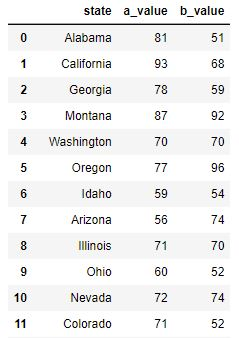
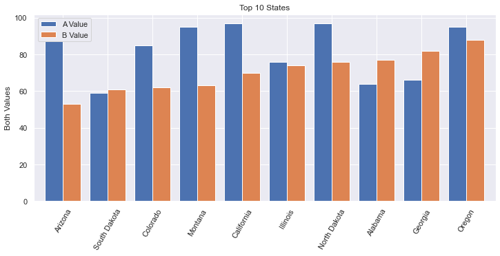
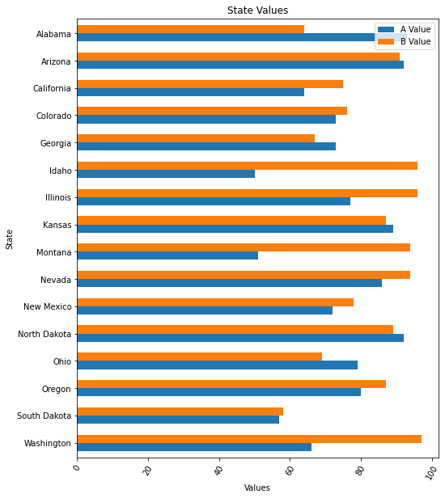

# Bar Charts
Bar charts are good when:  
* The x-axis is categorical and does not have a natural order (e.g. Country names).  
* There are very few points to show (e.g. 4 or less)  
* There isn't an obvious relationship to the prior value on the x-axis (because they are categorical).  
* You want to use color to emphasize the height or illustrate a relationship to another value.  
* You have a count you want to represent   
  
Bar charts are NOT good when:  
* You're attempting to show a correlation. (e.g. more X means more Y)  
* The data are indended to be continuous and not discrete  
* There are a lot of points to show (e.g. 20 or more)

There are a lot of different libraries and methods to create bar charts. Here is a quick summary. Details are found in the examples below.  
|API|When to use|
|---|-----------|
|`df.plot(kind='bar')`|There is only one value per category|
|`df.plot.barh()`|There is one value per category and horizontal bars adds meaning or there are many categories to show| 
|`plt.bar()`|Essentially the same as `df.plot`, but you may not have a DataFrame handy|  
|`plt.hist()`|You want to count occurences|  
|`sns.barplot()`|There are many values per category to be averaged. The data can be structured differently. |
|`sns.catplot(kind='bar')`|Effectively the same as `sns.barplot()`|    


## Positive vs Negative Bars
In this example bar chart you'll see that the positive values have green bars
while the negative values have red bars. The example below only uses two colors
to emphasize the direction of change. We use a bar chart here depsite there being
many different years to plot because the green/red colors emphasize the relative changes nicely.


````{tab-set}
```{tab-item} Image

```
```{tab-item} Code
```python
def pos_neg_bar_chart(df):
    # first create a figure with one axis
    fig, ax = plt.subplots(1)
    
    # create a color column
    df['color'] = df['Annual Change'].apply(lambda v: 'green' if v >= 0 else 'red')

    # create the bar chart with slightly wider bars
    df.plot(kind='bar', x='date', y='Annual Change', width=0.8, color=df['color'], ax=ax, label='Positive Change')
    plt.xticks(np.arange(0, 61, 10))
    plt.xlabel('Year')
    plt.ylabel('Change in %')
    plt.title('Annual Change in Inflation from 1961-2021')

    # slant the dates to be at an angle
    fig.autofmt_xdate()
```

```{tab-item} Data
Here are the first few lines of data in the DataFrame.  

```

```{tab-item} Comments
* The x-axis label has only a few years listed because of the method `plt.xticks(np.arange(0, 61, 10))`. This reduces the number of ticks in the graph and makes it much more readable.  
* The years on the x-axis look nice due to the `xticks` call as well as `fig.autofmt_xdate()`. One could instead use `plot.xticks(rotation=45)` to provide a custom rotation of the x-label.  
* The Title and y-axis labels use the phrase `Change in` meaning that the value is relative to the prior year. The chart does not plot the actual inflation rate of that year (which is almost always positive).    
```

````

## Overlayed Bars
This is a bar chart that has the values overlayed one on top of the other. The values are NOT stacked. This means that the
base of the tall bar is at the bottom: the top of the bar has a height as denoted on the y-axis.
This example shows how to overlay bar charts as well as to annotate the bars with a values. 

````{tab-set}
```{tab-item} Image

```
```{tab-item} Plot Code
```python
def annotated_bars(df):
    # generate a 'payback' column
    df['payback'] = df['return'] / df['investment']
    
    # get the custom-sized figure and axis for annotation work.
    fig, ax = plt.subplots(1, figsize=(15,5))
    
    # Graphs two bar charts on the same axis, one overlayed on top of the other. 
    # One value must be known to be greater than the other if it is to be seen.
    # Plot the larger value first so that it doesn't completely hide the smaller value.
    plt.bar(x=df['year'], height=df['return'], color='#10E0D0', label='Return')

    # add annotations before plotting the second set of values
    add_value_labels(ax, df['payback'], fmt='x{:.2f}')

    # plot the shorter bars second, on top of the taller bars
    plt.bar(x=df['year'], height=df['investment'], color='#A030A0', label='Investment')
        
    # Adds formatting specifications like a legend and title
    plt.xlabel('Year')
    plt.ylabel('Dollars')
    plt.xticks([int(y) for y in df['year']], rotation=-45)
    plt.legend()
    plt.title('Investments & Returns')
```
```{tab-item} Annotation Code
Code source: <a href="https://stackoverflow.com/questions/28931224/how-to-add-value-labels-on-a-bar-chart" target="_blank">
StackOverflow</a>
```python
def add_value_labels(ax, values, fmt="{:.1f}", spacing=2):
    """
    Add labels to the end of each bar in a bar chart.

    Arguments:
        ax (matplotlib.axes.Axes): The matplotlib object containing the axes
            of the plot to annotate.
        values: the sequence of values to show
        fmt: a customizable format string used to print the values
        spacing (int): The distance in pixels between the labels and the bars
    """
    # For each bar: Place a label
    for index, rect in enumerate(ax.patches):
        # Get X and Y placement of label from rect.
        y_value = rect.get_height()
        x_value = rect.get_x() + rect.get_width() / 2

        # Number of points between bar and label. Change to your liking.
        space = spacing
        # Vertical alignment for positive values
        va = 'bottom'

        # If value of bar is negative: Place label below bar
        if y_value < 0:
            # Invert space to place label below
            space *= -1
            # Vertically align label at top
            va = 'top'

        # Format the value into a label
        label = fmt.format(values[index])

        # Create annotation
        ax.annotate(
            label,                      # Use `label` as label
            (x_value, y_value),         # Place label at end of the bar
            xytext=(0, space),          # Vertically shift label by `space`
            textcoords="offset points", # Interpret `xytext` as offset in points
            ha='center',                # Horizontally center label
            va=va)                      # Vertically align label differently for
                                        # positive and negative values.
```
```{tab-item} Data
Here is the complete set of data in the DataFrame. Notice how the annotated values are not present in this 
initial dataframe. Instead, the plotting code calculates the "payback factor" and adds this column before
plotting. 

```

```{tab-item} Comments
* We broke out the annotation code separately because there is a lot going on there.  
* The overlayed bars is accomplished by plotting two bar charts, one with shorter bars on top of another with taller bars. The second plot covers up the first. If the second plot has values greater than the first, then the first plot's bars will be hidden.  
* The annotation code gets a bunch of rectangles (via `ax.patches`) that reveals the location of each bar in the plot. In creating this figure we have plotted multiple bar charts, so we need to annotate immediately after the first chart is plotted, otherwise we'd get many more rectangles due to the second plot.  
* We use custom colors for the bars using the `#RRGGBB` syntax.  
* The figure would be too narrow for our tastes, so we increase the figure size when calling `subplots`.  
```

````
## Sorted Bars
Bar charts usually have an x-axis that doesn't have a natural sorting order. However, sorting by the height of the bars is a valuable way to present data and insight.  

````{tab-set}
```{tab-item} Image

```
```{tab-item} Code
```python
def sorted_plt_bars(df):
    # we need the axis and a larger figure size to make this plot look nice
    fig, ax = plt.subplots(1, figsize=(12, 5))

    # remove any background grid that might be present (generally only needed if seaborn was used previously)
    ax.grid(False)

    # sort the dataframe. Here we assign back to df. Altneratively, we could have done `inplace=True`.
    df = df.sort_values(by='a_value', ascending=False)

    # no color parameter provided means that we default to a single blue color.
    bar = plt.bar(x=df['state'], height=df['a_value'])

    # this adds the value of the bar to the center of the bar
    ax.bar_label(bar, label_type='center')

    # make the x-axis values be slanted to ease the readability
    plt.xticks(rotation=60)

    # every plot needs good labels
    plt.title('Best "A Value" by State')
    plt.ylabel('A Value')
    plt.xlabel('')
```
```{tab-item} Data
This is the first 11 rows of the **orginal** data (which was unsorted).  


```
```{tab-item} Comments
* When there are a good number of bars, the viewer will benefit if the bars are sorted.   
* In this chart, text is added inside the bar to provide the bar's value. Without a grid background (which can be added when using seaborn), it can be hard to know what the precise value is. There are multiple ways to add text. In this example, we use the `ax.bar_label` API. But, one can also use `plt.text` or `ax.annotate` methods.  
* The x-axis label is purposely set to an empty string because the viewer can clearly the x-axis values and understand their meaning.  
* The colors of the bars can be cusomized using the `color` named parameter. You can set all the bars to one identical color, or pass in a sequence of values such as `df['color']` (if you create a meaningful and correct color column in the dataframe).  
```
```` 

## Stacked Bars
Sometimes the addition of multiple values has meaning and you'll want to stack one bar on top of another. This allows you to see
multiples values and their sum total. We still sort the bars by a specific value to provide some added insight.   

````{tab-set}
```{tab-item} Image

```
```{tab-item} Code
```python
def stacked_df_plot_kind(df):
    # create a figure of a good size
    fig, ax = plt.subplots(1, figsize=(12, 5))
    
    # sort by one of the values in the dataframe
    df = df.sort_values(by='a_value', ascending=False)

    # x-axis of a bar chart is taken from the index, so set the index to the state
    df = df.set_index('state') 

    # tell matplotl;ib to plot a bar chart where the bars are stacked
    df.plot(kind='bar', stacked=True, ax=ax)

    # set labels to make it all readable
    plt.xticks(rotation=60)
    plt.title('Stacked Bar')
    plt.xlabel('')
    plt.ylabel('Both Values')
```

```{tab-item} Data
This is the first 11 rows of the **orginal** data (which was unsorted).  


```

```{tab-item} Comments
* We could have chosen to sort by the sum total of the values charted. It all depends on what you're trying to illustrate.  
* If the DataFrame has more columns, each column's value will be stacked into this bar chart. Here, we have only two columns that are not the index value.  
```

````

## Side-by-side Bars
Sometimes you want to compare two values side-by-side across a set of categories. We demonstrate **TWO** ways to do this.  
1) `plt` offers a way using `stacked=False` where there are many columns with values to plot. 
2) `seaborn` allows us to plot using `hue='column'` when the data is structured differently.  

Be sure to look at the data structure in each of these two examples.  

````{tab-set}
```{tab-item} Image
Note that this image is very, very similar to the `Seaborn` plot generated with the code used below. The differences are: The legend does not have a title, the color shades are slightly different, the legend is fully opaque, there are  vertical grid lines. All of these are very subtle.   

```
```{tab-item} Code
```python
def plot_side_by_side(df):
    fig, ax = plt.subplots(1, figsize=(12, 5))
    # get the first 10 rows.
    # After sorting, we need to reset the index to allow .loc[:9] to work.
    df = df.sort_values(by='b_value', ascending=True).reset_index(drop=True)
    # recall that in Pandas, slices are inclusive on both ends
    df = df.loc[:9]

    # x-axis is taken from the index, so set that to the state
    df = df.set_index('state')

    # If we wanted to customize the colors, use: colormap='Spectral' (or something similar).
    # The named argument 'color' won't work nicely here. color='red' would set all bars red.
    # https://matplotlib.org/2.0.2/examples/color/colormaps_reference.html 
    df.plot(kind='bar', stacked=False, width=0.8, ax=ax)

    plt.xticks(rotation=60)
    plt.title('Top 10 States')
    plt.ylabel('Both Values')
    plt.xlabel('')
    plt.legend(['A Value', 'B Value'])
```

```{tab-item} Data
This is the first 11 rows of the **orginal** data (which was unsorted).  


```

```{tab-item} Comments
* More horizonal space is needed for side-by-side bar charts. You shouldn't show too many bars in one plot; we filter this chart down to just 10 states.  
* The width of each bar can give the chart a different feel. Here we increase the width a bit.  
* The color of the bars can be set manually via the named parameter `color`. But, this isn't what we want when we have side-by-side bars. Instead, we would want to use `colormap` which has a lot of [different options](https://matplotlib.org/2.0.2/examples/color/colormaps_reference.html), including gradients. Ultimately, we used the default colors.   
* I found it interesting that my first attempt to limit the data to 10 rows worked without having used `reset_index`. I'm not sure how it worked originally, but I'm pretty sure that always using reset_index() will work. Also, there is an `inplace` named argument that we explicitly needed to have set to `False` (or not set to True). This assures that the reset_index() returns a new dataframe.  
```

````
We can also use `Seaborn` to do this plot, but the data needs to be organized differently. We do a little extra
work to get the data to look right, but sometimes our data starts off looking this way. Furthermore, it
is really good to know about the method `pd.melt`. The resulting bar plot is virtually identical.  
````{tab-set}
```{tab-item} Image
Note that this image is very, very similar to the plot generated with `plt` above.    

```
```{tab-item} Data
This is the data after we `melt` the DataFrame to its new structure. The original data structure is shown in the `plt` example above.   


```
```{tab-item} Code
```python
def sns_side_by_side(df):
    fig, ax = plt.subplots(1, figsize=(12, 5))
    # get the first 10 rows of data sorted by b_value.
    # After sorting, we need to reset the index to allow .loc[:9] to work.
    df = df.sort_values(by='b_value', ascending=True).reset_index(drop=True)
    # recall that in Pandas, slices are inclusive on both ends
    df10 = df.loc[:9]
    
    # transform the dataframe using melt so that we go from having separate columns
    # for A & B values, to having a column that designates the Value_Type
    df10 = pd.melt(df10, id_vars='state', var_name='Value_Type', value_vars=['a_value', 'b_value'], value_name='Value')
    
    # Note that we use the named argument, hue, to have multiple side-by-side bars
    sns.barplot(data=df10, x='state', y='Value', hue='Value_Type')

    # Get the legend handles and labels from our axis to assure that we can
    # customize our legend with correct colors, title and labels.
    handles, labels = ax.get_legend_handles_labels()
    
    plt.xticks(rotation=60)
    plt.title('Top 10 States')
    plt.ylabel('Both Values')
    plt.xlabel('')
    plt.legend(handles=handles, title='Values', labels=['A Value', 'B Value'])
```

```{tab-item} Comments
* Often times, data will be organized as shown in the Data tab here. It then becomes easy to use `Seaborn` to plot, leveraging the named argument, `hue`.   
* The `melt` API is interesting. One could do all of this work by hand, but using the [melt function](https://pandas.pydata.org/pandas-docs/stable/reference/api/pandas.melt.html) is much easier to do.  
* I found it interesting that my first attempt to limit the data to 10 rows worked without having used `reset_index`. I'm not sure how it worked originally, but I'm pretty sure that always using reset_index() will work. Also, there is an `inplace` named argument that we explicitly needed to have set to `False` (or not set to True). This assures that the reset_index() returns a new dataframe.  
* In this example, `plt.legend(['A Value', 'B Value'])` did not show the correct colors of the bars. To fix this, I needed to get the plot's `handles` from the `axis` object. Furthermore, I gave the legend a title.
```

````
## Horizontal Bar Chart
If we want to plot our bars horizontally, we can leverage the `barh` method.   

````{tab-set}
```{tab-item} Image

```
```{tab-item} Code
```python
def df_horiz_plot(df):
    fig, ax = plt.subplots(1, figsize=(8, 10))
    df = df.sort_values(by='state', ascending=False)

    # x-axis is taken from the index, so set that to the state
    df = df.set_index('state')
 
    # plot using the barh API
    df.plot.barh(stacked=False, width=0.6, ax=ax)
    plt.xticks(rotation=60)
    plt.title('State Values')
    plt.xlabel('Values')
    plt.ylabel('State')
    plt.legend(['A Value', 'B Value'])
```

```{tab-item} Data
This is the first 11 rows of the **orginal** data (which was unsorted).  


```

```{tab-item} Comments
* DataFrame has a plot object. On this <a href="https://pandas.pydata.org/pandas-docs/stable/reference/api/pandas.DataFrame.plot.html" target="_blank">plot object</a> we can call the following methods:  
    * area  
    * bar  
    * barh  
    * box  
    * ... and a bunch more ...
```
````
## Histogram
Sometimes you want to know the number of times something occurs. A Histogram will allow you to do a bar plot that represents counts.  
````{tab-set}
```{tab-item} Image

```
```{tab-item} Code
```python
def hist_chart(df):
    plt.hist(df['distance'], bins=25)
    plt.xlabel('Distance')
    plt.ylabel('Count')
    plt.title('Count of Throwers at Each Distance')
```

```{tab-item} Data
This data is fake data generated for this coding example.  

```

```{tab-item} Comments
* `bins` is a numberical value that sets how many bars there will be. The idea is that you 'toss the items into bins' and then plot the count of items in each bin.  
* In this plot, we've initialized `seaborn` so there is a white grid in the background established with `sns.set_style('whitegrid')`.     
```
````

## Seaborn Colorful Bar Chart
Seaborn has a wide variety of fancy charts and offers easy ways to view insightful statistics. 
When it comes to bar charts it doesn't add that much. Here we show two things:  
1. Fancy colors and a different background   
2. Statistical analysis when there are many values per category on the x-axis  

````{tab-set}
```{tab-item} Image

```
```{tab-item} Code
```python
def sorted_bars(df):
    fig, ax = plt.subplots(1, figsize=(12, 5))
    # sets the background grid style
    sns.set_style("darkgrid")
    df = df.sort_values(by='a_value', ascending=False)

    # default to various colors. use color='navy' to set all bars to the same color.
    bar = sns.barplot(data=df, x='state', y='a_value', ax=ax)
    plt.xticks(rotation=60)
    
    plt.title('Best "A Value" by State')
    plt.ylabel('A Value')
    plt.xlabel('')
```

```{tab-item} Data
This is the first 11 rows of the **orginal** data (which was unsorted).  


```

```{tab-item} Comments
* The background is a dark grid, as set by `sns.set_style`.  
* The color of each bar is set using a `colormap` which has a lot of different options, including gradients. We can set colormap='xxx' to a variety of values as described in [colormaps reference](https://matplotlib.org/2.0.2/examples/color/colormaps_reference.html).  
* Note that there is only one data value for every State.  
```

````
## Seaborn Statistical Bar Chart
There can be many values that fall in a specific category. In this example, we analyze how far people can throw a ball. We have 400 samples of people's distance and gender and we show a simple bar chart showing the difference.  
````{tab-set}
```{tab-item} Image

```
```{tab-item} Code
```python
def sns_bar_stats(df):
    # display the line with the standard deviation instead of %95 confidence.
    # St. Dev is much better because we are not so focused on our confidence
    # in the average so much as the variance in the distance.
    sns.barplot(data=df, x='gender', y='distance', ci='sd')
    plt.ylabel('Distance')
    plt.xlabel('')
    plt.title('Avg with St Deviation of Distance by Gender')
```

```{tab-item} Data
This data is fake data generated for this coding example.  

```

```{tab-item} Comments
* The 'line' coming out of the bar represents some statistical information. In this chart, we have it represent the Standard Deviation to help is understand the variance in the data. 
* Note: in more current versions of Seaborn, 'ci' is deprecated in favor of 'errorbar'. There are three options for `ci`:  
    * None: don't draw an errorbar at all  
    * 95: (Some number 0-100). This is the percent confidence you want to have in the average. Small numbers result in short lines (or no lines). Large numbers result in larger lines. In other words, if you want a lot of confidence, you need a bigger range.  
    * 'sd': Shows the Standard Deviation instead of the mean.  
* By default, the line would represent the confidence interval of the average in the data. This may sound strange because we can calculate the average of the data exactly. But, in the world of statistics, we acknowledge that our data is just a sample of the entire population and may not accurately reflect reality. The larger our sample, the more confidence we can have in the data. Seaborn uses something called [bootstrapping](https://www.thoughtco.com/what-is-bootstrapping-in-statistics-3126172).   
```

````
