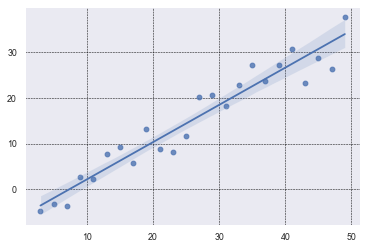
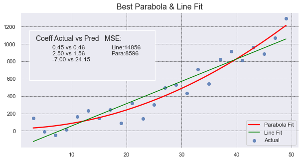
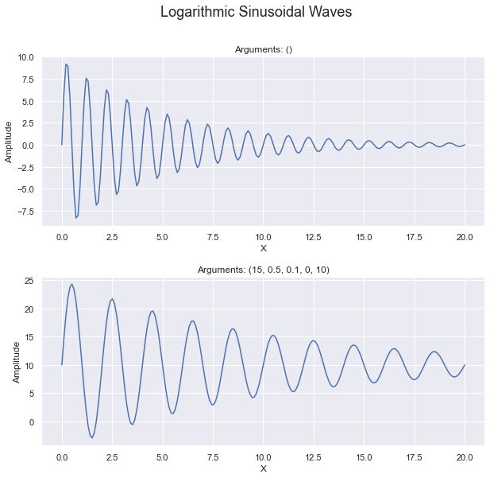
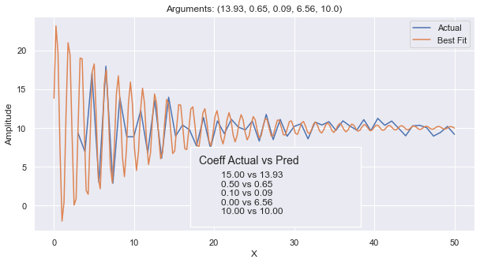

# Curve of Best Fit
In this section, we will show how you can identify a Curve of Best Fit for a set of data points.
The curve can be anything an equation can express, but there are some limitations with discontinuous curves and asymptotes.
The easiest is finding a line of best fit. Secondarily, you can find the polynomial that fits the data points. Tertiary,
you can provide an equation of a continuous curve involving a combination of functions such as sine or logarithm. 
Lasty, you can have a non-continuous curve like Sigmoid or `y = 1 / (x - 3).  

We will review four different ways to get the equation of a fitted curve.  
1. `scipy.stats.linregress`: a statistical method that identifies a line's coefficients as well some statistical information.  
2. `numpy.polyfit`: a Numpy method that identifies the coefficients of any n-ordered polynomial.  
3. `scipy.stats.curve_fit`: a statistical method that identifies the coefficients of **_any_ function** as well as some statistical information about the fit.  
4. `ML LinearRegression`: 

When identifying a Curve of Best Fit, it is good to know _how good_ the curve is at representing
the data points. We want an objective quanitification that tells us whether a straight line is better at fitting
the points, or some other curved line such as a parabola. We can compare how well two differen lines fit using 
the Mean Squared Error.  

Often we want to know how much of a correlation there is between the x & y data points. Afterall, 
we may have just asked Seaborn to plot a regression line and the line presented is the best line that fits the
data, but is the data linearly related at all? This is a different, but also important question! This is
answered by looking at the `Coefficient of Determination`.  

```{admonition} $R^2$ or Coefficient of Determination  
:class: dropdown tip
R-squared ($R^2$) is a statistical measure that provides an indication of how well the line of best fit (the regression line) fits the data points. It quantifies the proportion of the variance in the dependent variable (y) that can be explained by the independent variable (x) in a linear regression model.

The R-squared value ranges from 0 to 1. A value of 1 indicates that the regression line perfectly predicts the dependent variable, meaning all the data points lie exactly on the line. A value of 0 indicates that the regression line does not explain any of the variance in the dependent variable, and the points are scattered randomly.

In general, a higher R-squared value indicates a better fit of the line to the data. For example, an R-squared value of 0.8 means that 80% of the variability in the dependent variable is accounted for by the independent variable(s) in the model.
```

Here is a table that shows some of the most frequent API we used in this section. 

|API|Notes|  
|---|-----|
|[plt.plot](https://matplotlib.org/stable/api/_as_gen/matplotlib.pyplot.plot.html)|This does a simple line plot on the current axis. It does not offer 'ax=ax' argument.|  
|[plt.scatter](https://matplotlib.org/stable/api/_as_gen/matplotlib.pyplot.scatter.html)|This does a simple scatter plot on the current axis. It does not offer 'ax=ax' argument.|  
|[np.linspace](https://seaborn.pydata.org/generated/seaborn.regplot.html)| This creates a numpy array of values linearly spaced between [start, end] with a specific number of points. It is helpful in generating `x_data` during plotting.|   
|[np.polyfit](https://numpy.org/doc/stable/reference/generated/numpy.polyfit.html)|This identifies the coefficients of any n-ordered polynomial.|   
|[linregress](https://docs.scipy.org/doc/scipy/reference/generated/scipy.stats.linregress.html)|a statistical method that identifies a line's coefficients as well some statistical information.|  
|[curve_fit](https://docs.scipy.org/doc/scipy/reference/generated/scipy.optimize.curve_fit.html#scipy.optimize.curve_fit) |A statistical method that identifies the coefficients of **_any_ function** as well as some statistical information about the fit.|  
|[mean_squared_error](https://scikit-learn.org/stable/modules/generated/sklearn.metrics.mean_squared_error.html)|Calculates the Mean Squared Error (MSE) from two sets of y_data points.|  

```{admonition} code imports
:class: dropdown seealso

```python
import random
import numpy as np
import pandas as pd
import matplotlib.pyplot as plt
import seaborn as sns

from scipy.optimize import curve_fit
from scipy.stats import linregress
from scipy import stats
from sklearn.metrics import mean_squared_error

sns.set()

# This if for Jupyter Notebook only
%matplotlib inline
```

## Seaborn Regression
In many research projects, it is beneficial to find a curved line that best fits the data.
Students will often do a scatter plot of the data points and have Seaborn do a regression plot
which shows a line of best fit with a shaded area around the line representing
a 95% confidence interval. None of that is horrible. It is convenient to have a line of best fit, 
if there is one. And, `regplot` will draw one for you by default.  

````{tab-set}
```{tab-item} Simple regplot
  
```
```{tab-item} Code
```python
true_slope = 3/4
true_intercept = -4
x_data = [ x for x in range(3, 50, 2) ]
y_data = [ x*true_slope + random.randint(-5, 5) + true_intercept for x in x_data]

# Use the grid in the plot and set the line style to black & dashed
plt.grid(True, linestyle='--', linewidth=0.5, color='black')
sns.regplot(x=x_data, y=y_data)
```
```{tab-item} Comments
This is about as simple as it gets. We generated `x_data` with a simple comprehension. We could
have also used `np.linspace()`. We similarly created the `y_data` and added some noise with
`random.randint(-5, 5)`. By default, `regplot` will add a regression line and a confidence
interval. The confidence interval is 95% and students often misunderstand what it means. 

It does **NOT** mean that there is a 95% confidence that the points in the scatter plot will
fall within the shaded interval. Clearly, that is not the case!  

It means, insteatd, that there is a 95% confidence that the average of the scatter plot data falls within that range.
I know what you're thinking: the average of the data is clear and concrete--there is no need to estimate it. 
That is true. The average is easy to 
calculate with a finite set of points that **are** the _true population_ data. 
`regplot` estimates what the _true population_ might look like assuming that your data is just a sample. It then calculates
the confidence interval based on the assumption that the errors (residuals) in the regression model 
follow a normal distribution. It is 95% sure that the _true average_ falls in that range.  

Note that in your research, you may want to extend the curve of best fit out further. You can see
how to do this in the next plot below.  

Here are some helpful links:  
<a href="https://seaborn.pydata.org/tutorial/regression.html" target="_blank">Seaborn Tutorial</a>    
<a href="http://seaborn.pydata.org/generated/seaborn.regplot.html" target="_blank">Seaborn regplot API</a>    

```{admonition} Lastly
:class: important
It is common to hide the shaded confidence interval by setting the named parameter, `ci` to `None`, as follows:
```python
sns.regplot(x_data, y_data, ci=None)
```

````


## SciPy Linregress
````{tab-set}
```{tab-item} Annotated Regression
This plot shows a scatter plot of data drawn with `plt.scatter`. It then finds the line of best fit using
`linregress`. It plots it out, extending an extra 20 values on the x-axis, and it provides data on the
graph itself. It shows what the slope and y-intercept are (m & b), gives the $R^2$ value, and lastly
it presents the Mean Squared Error.  

```
```{tab-item} Code
```python
# use the same x_data & y_data in example above.
# To find details about the line, we need to use linregress.
slope, intercept, r_value, p_value, std_err = linregress(x_data, y_data)

# generate 100 x_fit points and go out 20 past x_data limits to show "prediction"
x_fit = np.linspace(min(x_data), max(x_data)+20, 100)
y_fit = intercept + slope * x_fit

# create a 'vector' (list of values) for the line of best fit.
# We use the scalar values (1 value) from linregress and the original x_data points.
# We need the same number of y values as are in y_data.
y_predicted = intercept + slope * np.array(x_data)

# Calculate the MSE 
mse = mean_squared_error(y_data, y_predicted)

# plot our data points with line of best fit with info on the graph
plt.figure(figsize=(10, 5))
plt.scatter(x_data, y_data, label='Actual')
plt.plot(x_fit, y_fit, color='red', label='Fitted')
plt.grid(True, linestyle='--', linewidth=0.5, color='black')
plt.legend()
plt.title('Best Linear Fit', fontsize=16)
plt.xlabel('X')
plt.ylabel('Y')
plt.text(42, 20, f'm = {slope:.2f}\nb = {intercept:.2f}\nR2 = {r_value**2:.2f}\nMSE = {mse:.2f}', 
         ha='left', va='top', fontsize=14)
```
```{tab-item} Comments
The nice thing about using `linregress` is that it will provide multiple pieces of information
for us in one simple call. It gives use the slope and intercept values, along with the `r_value` that
we can square to get the Coefficient of Determination.  

Interestingly, `linregress` returns an object, not a list of values. However, because the linrgress object
returns implements the special method `__iter__`, the object can be unpacked into a set of values. This gives
some flexibility in how the caller wants to receive the values. The caller can keep the object and dereference
the object, or the specific values can be immediately unpacked upon receipt. Cool!  

Example call: 
```python   
    line_info = linregress(x_data, y_data)
    print(f'R2={line_info.r_value**2:.2f}')  
```
````

## Numpy Polyfit  
Here we use `np.polyfit` to find the best fit for a line and a parabola. Put another way,
the coefficients of a polynomial of degree 1 and 2.  
````{tab-set}
```{tab-item} Best Fit Plot
The graph shows many things: scatter plot of data, line of best fit, parabola of best fit,
a legend, coefficients of the parabola of best fit, and MSE of both the parabola and line. Whew!  
It shows that the parabola is a much better fit for the points.  

```
```{tab-item} Code
```python
def add_inset_text(fig, position, actual, coeffs):
    # print values in an inset positioned in figure percentages [x, y, width, height]
    ax_inset = fig.add_axes(position)
    ax_inset.set_xlabel('')
    ax_inset.set_ylabel('')
    ax_inset.set_xticks([])
    ax_inset.set_yticks([])
    ax_inset.grid(False)
    text = 'Coeff Actual vs Pred'
    ax_inset.text(0.05, 0.90, text, ha='left', va='top', fontsize=14)
    text = ''
    for a, c in zip(actual, coeffs):
        text += f'{a:.2f} vs {c:.2f}\n'
    ax_inset.text(0.18, .70, text, ha='left', va='top', fontsize=12)
    return ax_inset
    
    
def best_parabola_fit():
    def parabola(x, a, b, c):
        y = a*x**2 + b*x + c
        return y

    def generate_points(a, b, c, noise):
        x_data = [ x for x in range(3, 50, 2) ]
        y_data = [ parabola(x, a, b, c) + random.randint(-noise, noise) for x in x_data]
        return x_data, y_data
    
    # establish our True parabola coefficients
    actual = (0.45, 2.5, -7)
    noise = 150
    x_data, y_data = generate_points(*actual, noise)
    
    # plot it all
    fig, ax = plt.subplots(figsize=(10,5))

    # Use the grid in the plot and set the line style to black & dashed
    plt.grid(True, linestyle='--', linewidth=0.5, color='black')
    
    # Eliminate the confidence interval shading of the parapola and color the line red
    sns.regplot(x=x_data, y=y_data, ax=ax, order=2, ci=None, line_kws={'color':'red'})
    
    # Determine if a linear line is a better fit using MSE
    # find the coefficients of the parbola that best fits the points generated
    # The coefficients are ordered from high order to lower order
    coeffs_2 = np.polyfit(x_data, y_data, 2)
    y_predicted_2 = [ coeffs_2[0]*x**2 + coeffs_2[1]*x + coeffs_2[2] for x in x_data]
    mse_degree_2 = mean_squared_error(y_data, y_predicted_2)
    
    #  get coefficients for the line
    coeffs_1 = np.polyfit(x_data, y_data, 1)
    # Use vector math instead of a comprehension this time (because we can)
    y_predicted_1 = coeffs_1[1] + coeffs_1[0] * np.array(x_data)
    mse_degree_1 = mean_squared_error(y_data, y_predicted_1)
    print('MSE Degree2:', mse_degree_2, ' MSE Degree1:', mse_degree_1)
    
    # add MSE to our inset text box
    ax_inset = add_inset_text(fig, [0.15, 0.50, 0.35, 0.28], actual, coeffs_2)
    ax_inset.text(0.6, 0.90, 'MSE:', ha='left', va='top', fontsize=14)
    text = f'Line:{mse_degree_1:.0f}\nPara:{mse_degree_2:.0f}'
    ax_inset.text(0.65, .70, text, ha='left', va='top', fontsize=12)
    
    # since plt.plot() does not offer ax=ax argument, and without it we plot on the inset,
    # use ax.plot() to get the line to show up on the right axis.
    ax.plot(x_data, y_predicted_1, color="green")
    ax.set_title('Best Parabola & Line Fit', fontsize=16)
    
    # Need to set the legend on the axis to get things to show up correctly,
    # even when setting label=''values' during plots, we need to set the label strings here.
    ax.legend(['Parabola Fit', 'Line Fit', 'Actual'], loc='lower right')

```
```{tab-item} Comments
In this code we use `sns.regplot` with `order=2` to draw a portion of a parabola (in red) that best 
fits our set of points (in blue). The order, value 2, tell Seaborn the highest exponent in the polynomial. 
A value of 2 means a parabola. The default value of 1 is a line. We also set `ci=None` to avoid drawing
any shaded area around the line.  

Seaborn will draw the line but it doesn't give us the equation of the line. It also fails to give us
any value that tells us how well the line fits our set of points. To identify the coefficients for
both the line and polynomial, we use `np.polyfit` and pass in the original data points with the order
of polynomial to use.  

Mean Squared Error (MSE) is defined to be the sum of all squared residuals (different between the line and
the data point). The implementation is quite simple:  
`   mse = sum([ (y1 - y2)**2 for y1, y2 in zip(y_points, y_line)])`  

In this sample code, we use "vector" math to calculate the y values for the line (or predicted curve).  
`   y_predicted_1 = coeffs_1[1] + coeffs_1[0] * np.array(x_data)`  

`Numpy` arrays are "vectors" and allow us to multiply them by a "scalar" (a constant, non-array). The above code will result
in a "vector" (numpy array of values) without having to do a for-loop or comprehension. You cannot do
this with a regular list; it requires a numpy array. Convention often has us representing a vector of
values with a capital letter which can sometimes be confused with a constant. Here would be another
conventional way to do vector math.  
`   X = np.array(list_of_x_values)`
`   Y = 3 * X + 4`  

Lastly, we make use of an inset to annotate some text to the graph so the reader can see how much
better the curve is over the line. MSE values are relative and the values depend on the scale of the numbers.
MSE values are most valuable when compared against another MSE value. In this case we can see how the 
parabola's MSE value is close to half the value of the line's MSE.  
```
````

## Curve Fit
Here we see how we can find a curve of best fit to a custom, continuous curve: a logarithmically degrading, sinusoidal wave. 
This is a continuous curve with no x-value that causes a division by zero. This allows us to use the `curve_fit` API. It will
highly unlikely that you'll ever want to fit a set of points to a curve like this. In the event that you ever encounter
wave data, you'll more likely want to leverage <a href="https://youtu.be/spUNpyF58BY" target="_blank">Fourier Transforms.</a> The
reason we use a sinusoidal wave is simply to illustrate how `curve_fit` can be used on any curve.  

To fit a line to a curve:  
1. Identify an equation that you want to fit. You'll create a method that has the generalized
equation with coefficients that are unknown. For example, a line is: `y = mx + b` where curve_fit will identify the values
for `m` and `b`. You may have a polynomial curve such as: `y = a*x**4 + b*x**3 + c*x**2 + d*x + e` and curve_fit will
find the values for `a` through `e`. If you know want to fix one of the values, you can use a constant to the known
value. Write a method that takes `x` along with the coefficiencts are arguments. For example:  
```python
def my_function(x, a, b, c):
    return a*x**2 + b*x + c
```
2. Select a set of values for the coefficients that represents a valid guess. Assign these coefficients to a
list, often named, `p0`. You'll provide `p0` as an argument to `curve_fit` to help it get started as well as to
understand how many coefficients to solve for.  
3.  You'll call `curve_fit` with the following arguments: methoid pointer, set of points you want to fit, along 
with the initial guess. For example:
```python
# curve_fit returns a tuple. The first item is a list of coefficients. The second
# is statistical information about the coefficients. In this example we ignore
# the covariance values, and so we unpack them into the identifer '_' which is a conventional
# name for a variable that goes ignored and unused.
coeffs, _ = curve_fit(logarithmic_sinusoidal_wave, x_data, y_data, p0=p0)
```
````{tab-set}
```{tab-item} Sinusoidal  
In our custom curve, we have coefficients for each of the following: amplitude, frequency, rate of logarithmic 
degredation, phase and offset.  

The top plot has "zero arguments" provided in the method `logarithmic_sinusoidal_wave` which means that
it uses all the default values (10, 1, 0.2, 0, 0). This is why the title of the top plot is: "Arguments: ()".  

The bottom plot is the same equation but with specific coefficients provided (15, 0.5, 0.1, 0, 10). It 
shows how the coefficients impact the curve. Pay attention to the values on the y-axis.   


```{admonition} See Code
:class: dropdown seealso
```python
def logarithmic_sinusoidal_wave(x, a=10, frequency=1, r=0.2, phase=0, offset=0):
    # Logarithmic convergence of amplitude
    amplitude = a * np.exp(-r * x)
    return offset + amplitude * np.sin(2 * np.pi * frequency * x + phase)

def plot_with_args(ax, x_max, *args):
    # Generate x values
    x = np.linspace(0, x_max, 200)
    # Compute y values (plural) 
    y = logarithmic_sinusoidal_wave(x, *args)

    # Plot on the axis & show labels
    ax.plot(x, y)
    ax.set_xlabel('X')
    ax.set_ylabel('Amplitude')
    ax.set_title(f'Arguments: {args}')
        
def show_sinusoidal_curve():    
    fig, (ax1, ax2) = plt.subplots(2, figsize=(10, 9))
    # add some more spacing horizontally between the two subplots
    plt.subplots_adjust(hspace=0.3)
    plot_with_args(ax1, 20)
    
    wave_args = (15, 0.5, 0.1, 0, 10)
    plot_with_args(ax2, 20, *wave_args)
    
    plt.suptitle('Logarithmic Sinusoidal Waves', fontsize=18)
```
```{tab-item} Best Fit
This plot shows the generated data points (that have noise) as small red dots. These data points
were derived by adding a noise ($\pm 1$) to the sinusoidal equation using the argments (15, 0.5, 0.1, 0, 10).  

The blue line is the best fit curve that fits the `logarithmic_sinusoidal_wave` (provided
in the code of the Sinusoidal tab.)  

The inset shows how the actual arguments used when generating the points with noise, and it compares
them against the coefficients for the curve of best fit. Here you can see that it slightly underestimated
the amplitidue. It was 0.15 off of the frequency, only 0.01 way from the rate of degradation, and only
0.02 away from the offset. The phase was 6.56 off of the actual phase used.  

```
```{tab-item} Code
```python
 def find_curve_best_fit():
    def generate_points(noise, *args):
        '''
        *args : allow us to call the function with any number of arguments so long as they are in order.
                we would just default the rest of the argument values.
        '''
        x_data = np.linspace(3, 50, 55)
        y_data = [ logarithmic_sinusoidal_wave(x, *args) + random.uniform(-noise, noise) for x in x_data]
        return x_data, y_data
    
    # establish our True curve parameters and generate points
    wave_args = (15, 0.5, 0.1, 0, 10)
    x_data, y_data = generate_points(1, *wave_args)
    
    # get our initial guess as to what the coefficients will be.
    # the count of arguments here tells curve_fit how many arguments to optimize.
    p0 = (15, 1, .5, 0, 0)
    # find our curve of best fit from the line, and round off the coefficient values
    coeffs, _ = curve_fit(logarithmic_sinusoidal_wave, x_data, y_data, p0=p0)
    coeffs = tuple([ round(t, 2) for t in coeffs  ])

    # Plot all of it
    fig, ax = plt.subplots(1, figsize=(10, 5))
    ax.scatter(x_data, y_data, s=10, color='r')
    plot_with_args(ax, 50, *coeffs)
    ax.legend(['Best Fit', 'Actual'])
    pos = [ .4, .14, .3, .28 ]
    add_inset_text(fig, pos, wave_args, coeffs)
```
```{tab-item} Comments
The code for the sinusoidal curve equation is provided in the 'See Code' dropdown in the 
'Sinusoidal' tab. In this method we chose to have all the coefficients be named arguments with
default values. This allows us to to easily modify our code to hold some values constant and
allow `curve_fit` to solve for the others. If we had chosen to make `p0` have only two values
in it, then curve_fit would have solved for amplitude & frequency while holding `r`, `phase`
and `offset` constant.  

In this plot, we first generated our set of points to which we will fit the sinusoidal curve.
These points are intended to be 'actual' data points in our hypothetical experiment that will have some noise.
We generate the points by calling our sinusoidal method will all the coefficients and then add some
random values intended to be "noise" or imperfections in the data. 

We chose to pass around the many coefficient to `generate_points` and `logarithmic_sinusoidal_wave` by
using a tuple of values. `wave_args` is a tuple with all the "true" coefficients used in the 
hypothetical experiement. The use of tuple shortens the code and makes it easier to read, so
long as you understand what is going on. We unpack the values when we call `generate_points` which
collects and repacks them into the tuple named 'args'. In turn, it can easily call the sinusoidal method
with the tuple. Altogether, this allows us to generate points and solve for coefficients using as many or
as few arguments as we want, using default values for the rest.

Confusing? See [Arguments](../module-additions/module3/printing) for more information.  

When generating our data points, we make use of `linspace` which is a nifty method that allows us
to quickly set a minimum, maximum, and an arbitrary number of points. It generates values
evenly spaced in that range.  

`curve_fit` does a lot of work for us, making use of calculus and statistics to find the coefficients
to the equation we established. Each coefficient represents one dimension, and our equation
represents values in an n-dimensional space. It then uses a method similar to "Gradient Descent"
to find values that minimize the Mean Squared Error for our coefficients and the set of actual points.

Confusing? See the video, <a href="https://youtu.be/IHZwWFHWa-w?t=567" target="_blank">Gradient descent, how nerual
networks learn</a>, by 3Blue1Brown, to get a great visual on Gradient Descent. This video is tailored
to neural networks, but the idea is the same. Gradient Descent is a mathematical method for optimizing
in n-dimensional space.  

Note that in `ax.scatter` we provided the x & y data as lists and set some named arguments.
It can be frustrating that plotting methods often have named arguments with different names. 
When we call `scatter` on the axis object, we set `s` to change the size of the markers (or dots).   

To add more value to the graph, we create an inset with text on the graph.  
```
````

# ML regressions
https://realpython.com/linear-regression-in-python/
https://datagy.io/mean-squared-error-python/
`model = LinearRegression()`
Students will often pursue a Machine Learning model to do predictions which it is great at doing. 
ML models are intended to do predictions.
